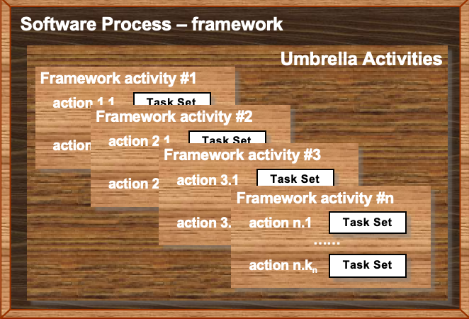
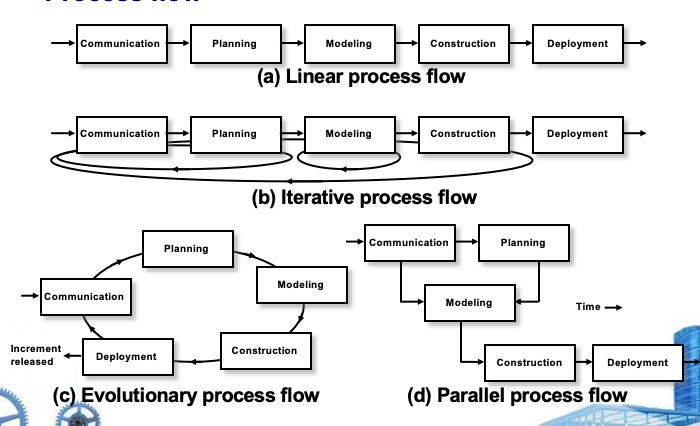
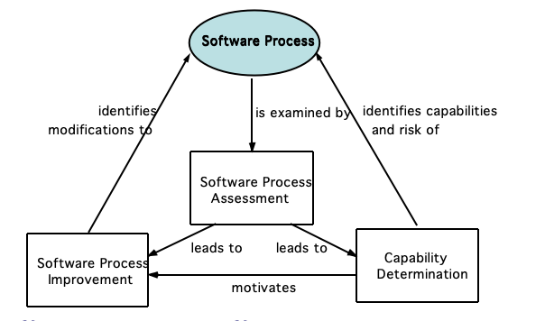

# Ch.3 Software Process Structure

## 3.1 通用过程模型 (A Generic Process Model)

### 软件过程框架

软件过程是一个**框架**，包含以下结构：

*软件过程 = 框架活动 (Framework Activities) + 伞活动 (Umbrella Activities)*

**框架活动结构**

| 框架活动 | 动作 (Actions) | 任务集 (Task Set) |
|---------|---------------|------------------|
| Framework Activity #1 | action 1.1 ~ 1.k1 | 每个动作对应一个任务集 |
| Framework Activity #2 | action 2.1 ~ 2.k2 | 每个动作对应一个任务集 |
| Framework Activity #3 | action 3.1 ~ 3.k3 | 每个动作对应一个任务集 |
| ... | ... | ... |
| Framework Activity #n | action n.1 ~ n.kn | 每个动作对应一个任务集 |

!!! note "思考问题"
    "有序的方法" (orderly approach) 真的那么好吗？
!!!

---

### 过程流 (Process Flow)

软件过程的五个核心框架活动：

- **Communication** (通信)
- **Planning** (规划)
- **Modeling** (建模)
- **Construction** (构建)
- **Deployment** (部署)

**四种过程流模型**

| 流程类型 | 描述 | 特点 |
|---------|------|------|
| **(a) Linear Process Flow**   线性过程流 | Communication → Planning → Modeling → Construction → Deployment | 顺序执行，一次性完成 |
| **(b) Iterative Process Flow**   迭代过程流 | 重复执行五个活动，每次迭代完善产品 | 循环往复，逐步完善 |
| **(c) Evolutionary Process Flow**   演化过程流 | 每次迭代发布一个增量版本 | 渐进式交付，持续演化 |
| **(d) Parallel Process Flow**   并行过程流 | 多个活动同时进行 | 并发执行，缩短周期 |

!!! example "过程流对比"
    - **线性流**：适合需求明确、变化少的项目
    - **迭代流**：适合需求逐步明确的项目
    - **演化流**：适合需要快速交付、持续改进的项目
    - **并行流**：适合大型项目，多团队协作
!!!

---

## 3.4 过程模式 (Process Patterns)

### 过程模式的定义

**过程模式**定义了一组活动、动作、工作任务、工作产品和/或相关行为。

### 通用软件模式元素

使用**模板**来定义模式，包含以下元素：

| 元素 | 描述 |
|------|------|
| **Meaningful Pattern Name**   有意义的模式名称 | 清晰描述模式的用途 |
| **Intent**   意图 | 模式的目标 |
| **Type**   类型 | - **Task Pattern** (任务模式)：定义工程动作或工作任务   - **Stage Pattern** (阶段模式)：定义过程的框架活动   - **Phase Pattern** (阶段模式)：定义框架活动的序列或流程 |
| **Initial Context**   初始上下文 | 描述使用模式前必须满足的条件 |
| **Solution**   解决方案 | 描述如何正确实现模式 |
| **Resulting Context**   结果上下文 | 描述模式成功实现后的条件 |
| **Related Patterns**   相关模式 | 链接到与此模式直接相关的其他模式 |
| **Known Uses/Examples**   已知用途/示例 | 模式适用的实例 |

!!! note "模式的作用"
    过程模式提供了可复用的最佳实践，帮助团队在不同项目中应用成熟的软件工程方法。
!!!

---

## 3.5 过程评估 (Process Assessment)

### 过程评估框架

### 常用评估标准

| 评估方法 | 全称/描述 |
|---------|----------|
| **SCAMPI** | Standard CMMI Appraisal Method for Process Improvement |
| **CBA IPI** | CMM-Based Appraisal for Internal Process Improvement |
| **SPICE** | ISO/IEC 15504 (Software Process Improvement and Capability Determination) |
| **ISO 9001:2000** | 针对软件的质量管理体系标准 |

---

## 3.6 能力成熟度模型集成 (CMMI)

### CMMI 简介

**CMMI** (Capability Maturity Model Integration) 由卡内基梅隆大学软件工程研究所 (SEI of CMU) 开发。

### CMMI 五个成熟度等级

| 等级 | 名称 | 描述 |
|------|------|------|
| **Level 0** | **Incomplete**   不完整 | 过程未执行或未实现该级别定义的所有目标 |
| **Level 1** | **Performed**   已执行 | 执行了生成所需工作产品的工作任务 |
| **Level 2** | **Managed**   已管理 | - 工作人员有足够资源完成工作   - 利益相关者积极参与   - 工作任务和产品被监控、审查和评估 |
| **Level 3** | **Defined**   已定义 | 管理和工程过程已文档化、标准化，并集成到组织级软件过程中 |
| **Level 4** | **Quantitatively Managed**   量化管理 | 使用详细度量对软件过程和产品进行量化理解和控制 |
| **Level 5** | **Optimizing**   持续优化 | 通过过程的量化反馈和测试创新想法，实现持续过程改进 |

!!! note "CMMI 等级提升"
    - **Level 1 → 2**：从混乱到可重复
    - **Level 2 → 3**：从项目级到组织级
    - **Level 3 → 4**：从定性到定量
    - **Level 4 → 5**：从控制到优化
!!!

!!! example "CMMI 应用"
    许多大型软件企业使用 CMMI 评估和改进其软件开发过程，Level 3 及以上通常被视为成熟的软件组织标志。
!!!

---

## 关键要点总结

1. **软件过程是框架**：由框架活动和伞活动组成
2. **四种过程流**：线性、迭代、演化、并行
3. **过程模式**：提供可复用的最佳实践模板
4. **过程评估**：通过评估识别能力和改进方向
5. **CMMI**：从不完整到持续优化的五个成熟度等级
