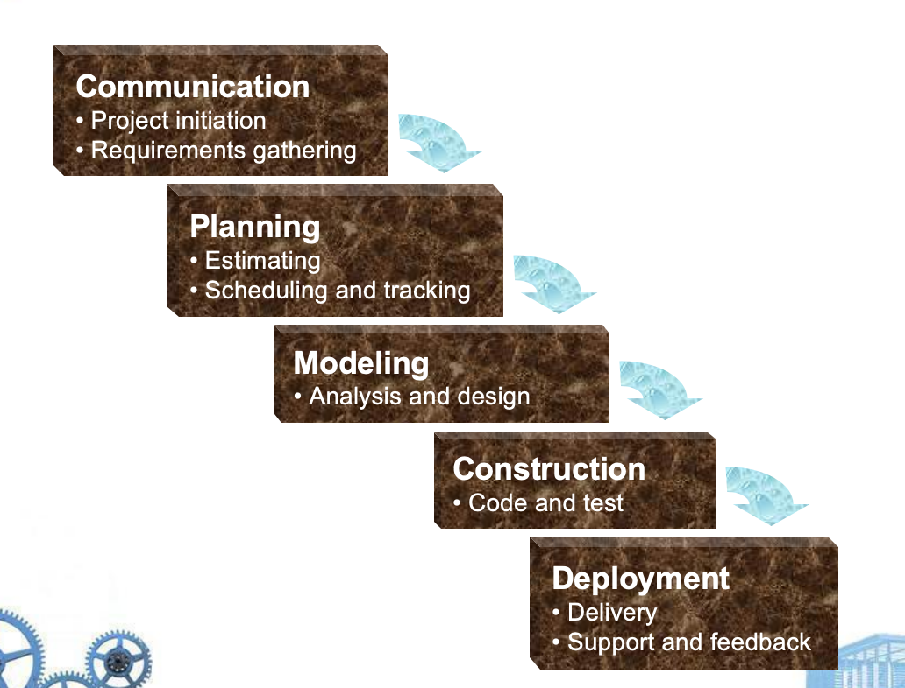
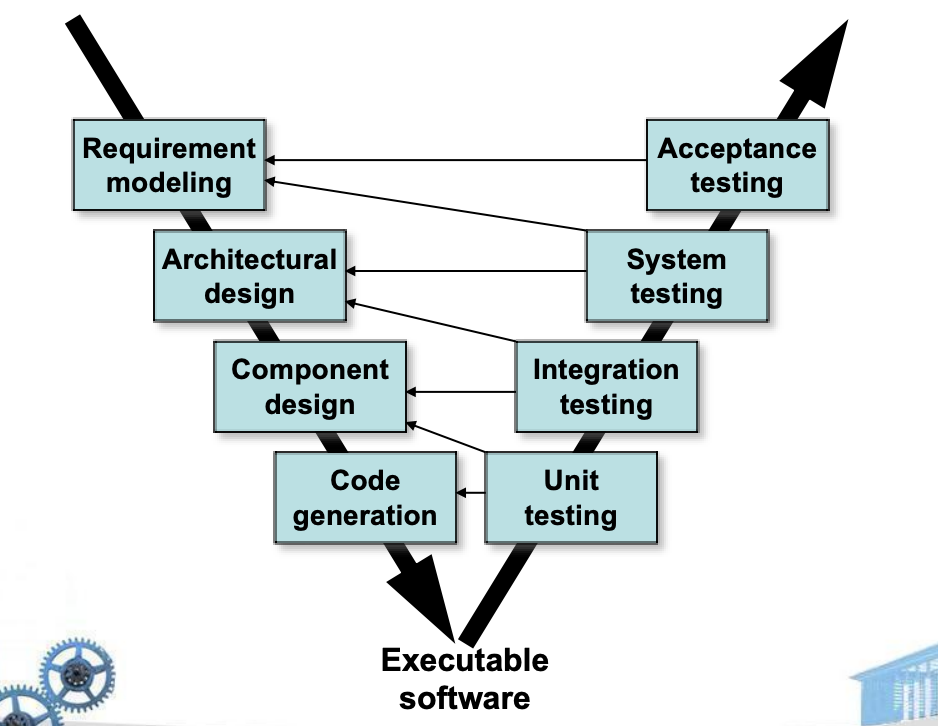
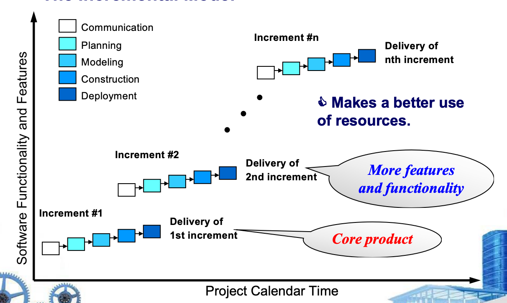
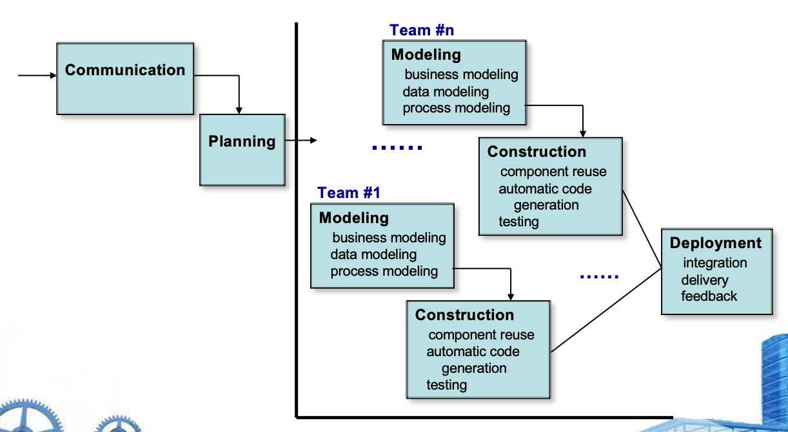
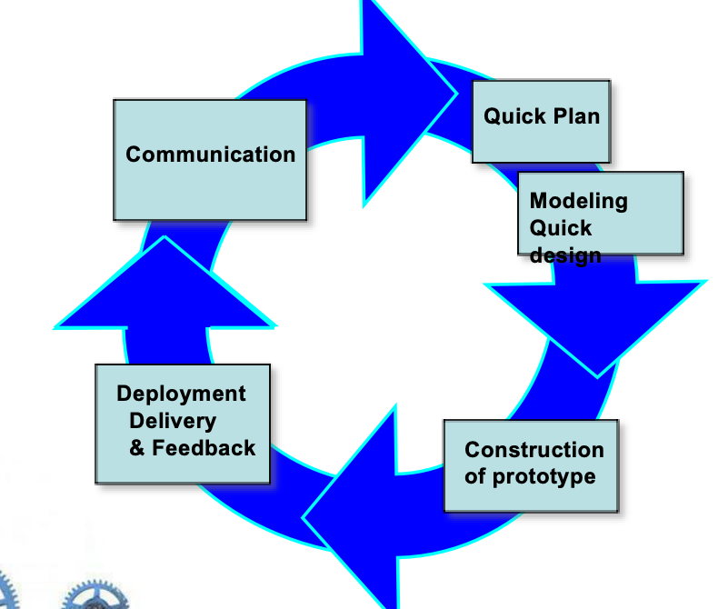
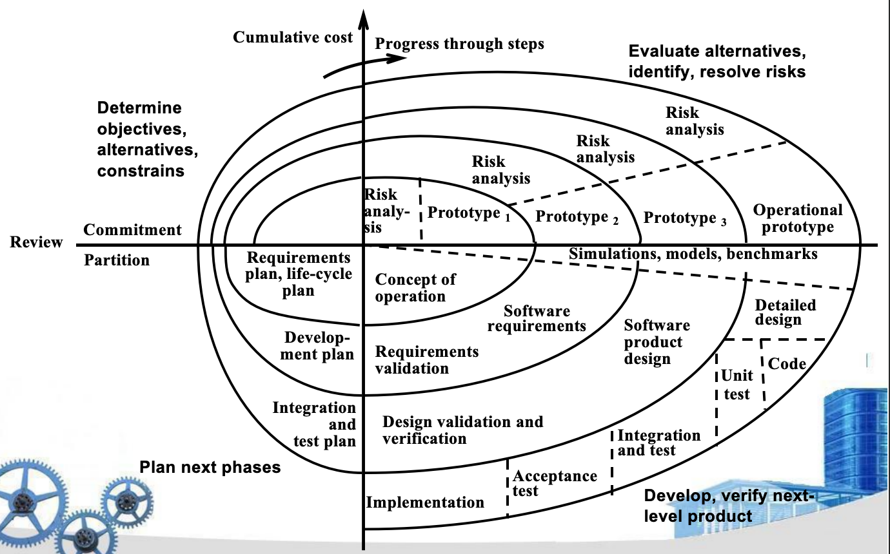
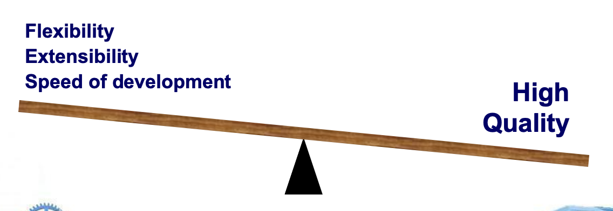
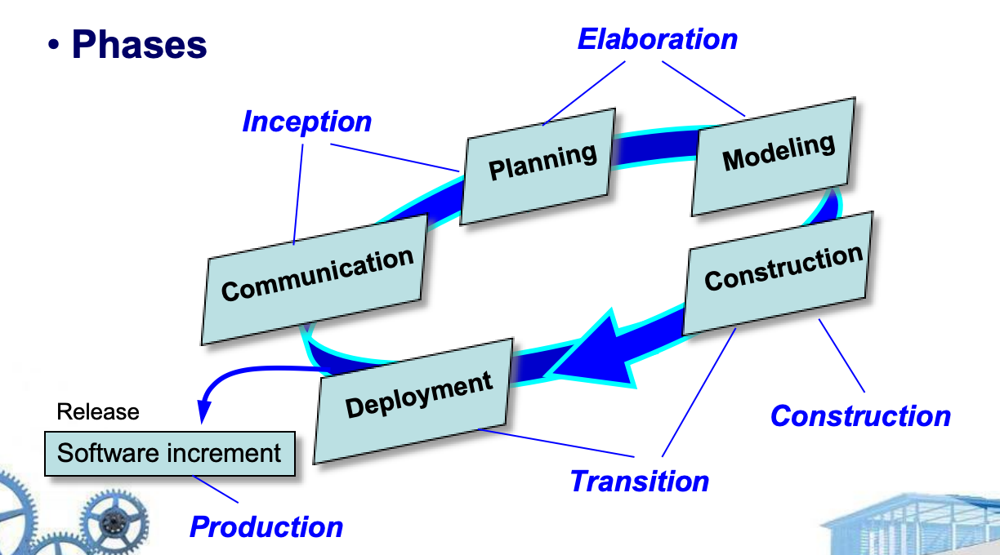

# Ch.4 Process Models

## 4.1 规范性模型 (Prescriptive Models)

### 规范性过程模型的定义

**规范性过程模型** (`Prescriptive process models`) 倡导一种有序的软件工程方法。

!!! question "思考问题"
- 如果规范性过程模型追求结构和秩序(`structure` and `order`)，那么它们是否不适合一个依赖变化的软件世界？
- 然而，如果我们拒绝传统的过程模型（以及它们所隐含的秩序），并用更少结构化的东西取而代之，我们是否会使软件工作中的协调和一致性变得不可能实现？

**关键问题**: "有序的方法"真的那么好吗？
!!!

---

## 4.1.1 瀑布模型 (The Waterfall Model)

### 经典生命周期



**五个阶段**

| 阶段 | 活动内容 |
|------|---------|
| **Communication** <br> 通信 | - 项目启动 (`Project initiation`) <br> - 需求收集 (`Requirements gathering`) |
| **Planning** <br> 规划 | - 估算 (`Estimating`) <br> - 调度和跟踪 (`Scheduling and tracking`) |
| **Modeling** <br> 建模 | - 分析和设计 (`Analysis and design`) |
| **Construction** <br> 构建 | - 编码和测试 (Code and test) |
| **Deployment** <br> 部署 | - 交付 (Delivery) <br> - 支持和反馈 (Support and feedback) |

### 瀑布模型的问题

!!! warning "瀑布模型的局限性"
1. **顺序流问题**: 实际项目很少遵循顺序流程
2. **需求问题**: 客户通常无法明确表述所有需求
3. **交付延迟**: 可工作的版本要到项目后期才能获得
!!!

---

### V 模型 (The V-Model)

V 模型是瀑布模型的变体，强调测试与开发阶段的对应关系：

```
需求建模 ──────────────────→ 验收测试
    ↓                           ↑
架构设计 ────────────────→ 系统测试
    ↓                       ↑
组件设计 ──────────→ 集成测试
    ↓               ↑
代码生成 ──→ 单元测试
         ↓
    可执行软件
```



| 开发阶段 | 对应测试阶段 |
|---------|-------------|
| 需求建模 (Requirement modeling) | 验收测试 (Acceptance testing) |
| 架构设计 (Architectural design) | 系统测试 (System testing) |
| 组件设计 (Component design) | 集成测试 (Integration testing) |
| 代码生成 (Code generation) | 单元测试 (Unit testing) |

!!! note "V 模型的意义"
    V 模型强调了测试计划应该在对应的开发阶段就开始制定，而不是等到编码完成后才开始考虑测试。
!!!

---

## 4.1.2 增量过程模型 (Incremental Process Models)

### 增量模型 (The Incremental Model)

增量模型将产品分解为一系列增量，每个增量提供越来越多的功能。

**增量开发流程**



!!! example "增量模型的优势"
    - 更好地利用资源
    - 早期交付核心功能
    - 降低项目风险
    - 更容易适应需求变化
!!!

---

### 快速应用开发模型 (RAD - Rapid Application Development)

**RAD 模型结构**



### RAD 模型的适用性

!!! warning "RAD 不适用的场景"
    1. **系统无法模块化**: 如果系统不能被合理地模块化，RAD 可能无法工作
    2. **需要调整接口**: 如果需要调整接口，RAD 可能无法工作
    3. **技术风险高**: 当技术风险很高时，RAD 不合适
    4. **资源不足**: 需要足够的人力资源
    5. **承诺不足**: 需要开发者和客户都承诺参与快速活动
!!!

!!! note "思考问题"
    我们的项目适合 RAD 吗？
!!!

---

## 4.1.3 演化过程模型 (Evolutionary Process Models)

### 原型模型 (Prototyping)

**原型开发流程**



!!! example "原型模型的应用场景"
    - 客户有合理需求，但对细节不清楚
    - 原型是第一步，用于澄清需求

    **重要**: 原型必须被丢弃（throw away）
!!!

---

### 螺旋模型 (The Spiral Model)

**螺旋模型的四个象限**



**螺旋模型的演化过程**

| 迭代轮次 | 产出物 |
|---------|--------|
| **第1轮** | 概念运营 (Concept of operation) |
| **第2轮** | 原型 1 (Prototype 1) |
| **第3轮** | 原型 2 (Prototype 2) |
| **第4轮** | 原型 3 (Prototype 3) |
| **第n轮** | 运营原型 (Operational prototype) |

**每轮包含的活动**

1. **确定目标、备选方案和约束**
2. **评估备选方案，识别和解决风险**
   - 风险分析
   - 模拟、模型、基准测试
3. **开发和验证下一级产品**
   - 需求计划、生命周期计划
   - 软件需求
   - 软件产品设计
   - 详细设计
   - 编码、单元测试
   - 集成和测试
   - 验收测试
4. **规划下一阶段**

!!! note "螺旋模型的特点"
    - 结合了原型模型和瀑布模型的优点
    - 强调风险分析
    - 适合大型、复杂、高风险的项目
!!!

---

## 4.1.4 并发开发模型 (The Concurrent Development Model)

### 并发模型的特点

| 特性 | 描述 |
|------|------|
| **定义事件** | 定义一系列事件，触发每个活动、动作或任务从一个状态到另一个状态的转换 |
| **网络结构** | 定义活动网络而不是线性事件序列 |
| **适用场景** | 特别适合客户端/服务器应用 |

### 并发模型的优势

- **灵活性** (Flexibility)
- **可扩展性** (Extensibility)
- **开发速度** (Speed of development)
- **高质量** (High Quality)



---

## 4.2 专用过程模型 (Specialized Process Models)

| 模型 | 描述 |
|------|------|
| **基于组件的开发** <br> Component based development | 当复用是开发目标时应用的过程 |
| **形式化方法** <br> Formal methods | 强调需求的数学规范 |
| **面向方面的软件开发** <br> `Aspect-Oriented Software Development` (AOSD) | 为定义、规范、设计和构造方面 (aspects) 提供过程和方法论方法 |

---

## 4.3 统一过程 (The Unified Process)

### 统一过程的定义

统一过程是一个 **"用例驱动、以架构为中心、迭代和增量"** 的软件过程，与统一建模语言 (UML) 紧密结合。

### 统一过程的四个阶段



---

### 统一过程的工作产品

| 阶段 | 主要产出物 |
|------|-----------|
| **初始阶段** <br> (Inception) | - 愿景文档 (Vision document) <br> - 初始用例模型 (Initial use-case model) <br> - 初始项目术语表 (Initial project glossary) <br> - 初始业务案例 (Initial business case) <br> - 初始风险评估 (Initial risk assessment) <br> - 项目计划（阶段和迭代） <br> - 业务模型 (Business model) <br> - 原型 (Prototypes) |
| **细化阶段** <br> (Elaboration) | - 用例模型 (Use-case model) <br> - 功能和非功能需求 <br> - 分析模型 (Analysis model) <br> - 软件架构描述 <br> - 可执行架构原型 <br> - 初步设计模型 <br> - 修订风险列表 <br> - 项目计划（迭代计划、工作流、里程碑） <br> - 初步用户手册 |
| **构建阶段** <br> (Construction) | - 设计模型 (Design model) <br> - 软件组件 (Software components) <br> - 集成软件增量 <br> - 测试计划 (Test plan) <br> - 测试用例 (Test cases) <br> - 支持文档（用户、安装、增量） |
| **移交阶段** <br> (Transition) | - 交付的软件增量 <br> - Beta 测试报告 <br> - 用户反馈 |

!!! note "统一过程的特点"
    - **用例驱动**: 以用户需求为中心
    - **以架构为中心**: 强调软件架构
    - **迭代和增量**: 逐步完善和交付
!!!

---

## 4.4 个人和团队过程模型 (Personal and Team Process Models)

### 个人软件过程 (PSP - Personal Software Process)

PSP 推荐五个框架活动：

| 活动 | 描述 |
|------|------|
| **Planning** <br> 规划 | 制定个人开发计划 |
| **High-level design** <br> 高层设计 | 设计软件架构 |
| **High-level design review** <br> 高层设计评审 | 评审设计 |
| **Development** <br> 开发 | 编码和单元测试 |
| **Postmortem** <br> 事后分析 | 总结和改进 |

!!! note "PSP 的核心思想"
    - 强调每个软件工程师需要**尽早识别错误**
    - 更重要的是，**理解错误的类型**
!!!

---

### 团队软件过程 (TSP - Team Software Process)

TSP 的特点：

| 特性 | 描述 |
|------|------|
| **项目启动** | 每个项目使用"脚本"启动，定义要完成的任务 |
| **自主团队** | 团队是自主导向的 (self-directed) |
| **鼓励度量** | 鼓励进行度量 (Measurement is encouraged) |
| **过程改进** | 分析度量数据，旨在改进团队过程 |

!!! example "PSP vs TSP"
    - **PSP**: 关注**个人能力提升**，强调个人过程纪律
    - **TSP**: 关注**团队协作**，强调团队过程管理和持续改进
!!!

---

## 关键要点总结

| 模型类型 | 代表模型 | 适用场景 |
|---------|---------|---------|
| **规范性模型** | 瀑布模型、V模型 | 需求明确、变化少的项目 |
| **增量模型** | 增量模型、RAD | 需要快速交付、资源充足 |
| **演化模型** | 原型模型、螺旋模型 | 需求不明确、高风险项目 |
| **并发模型** | 并发开发模型 | 客户端/服务器应用 |
| **统一过程** | UP/RUP | 大型、复杂的面向对象系统 |
| **个人/团队** | PSP/TSP | 强调过程改进和质量管理 |
