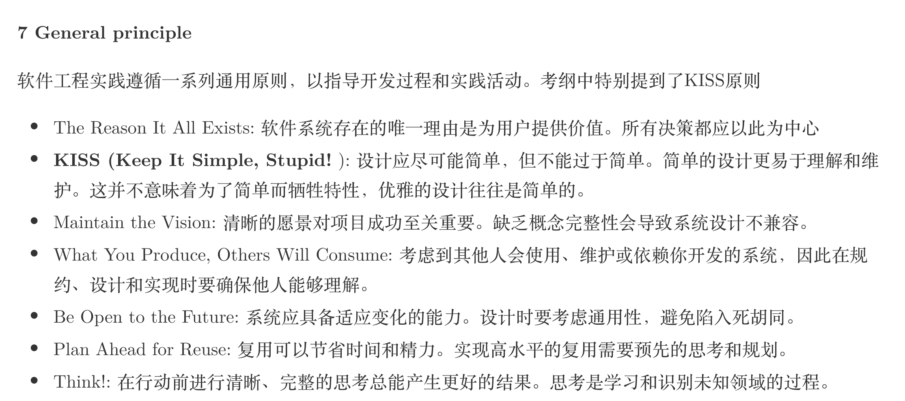
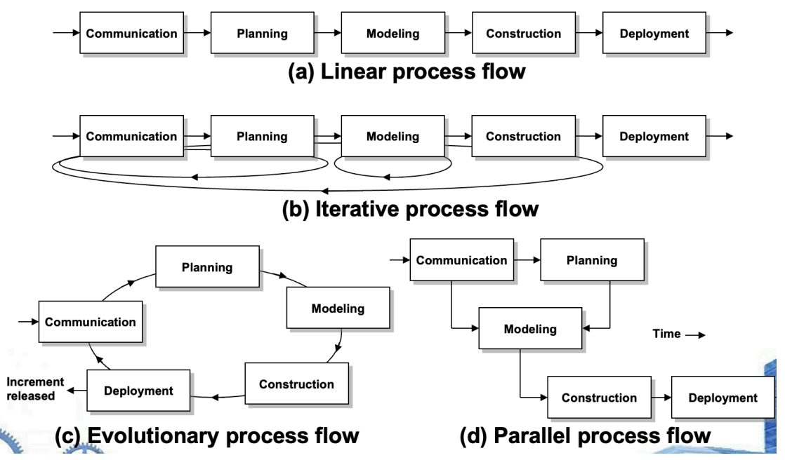
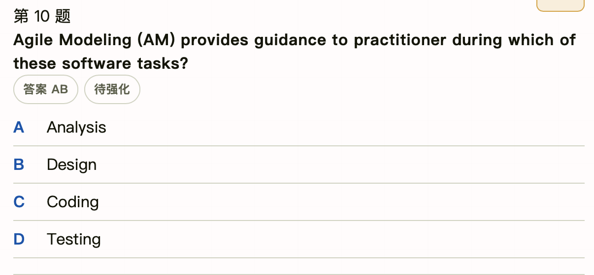
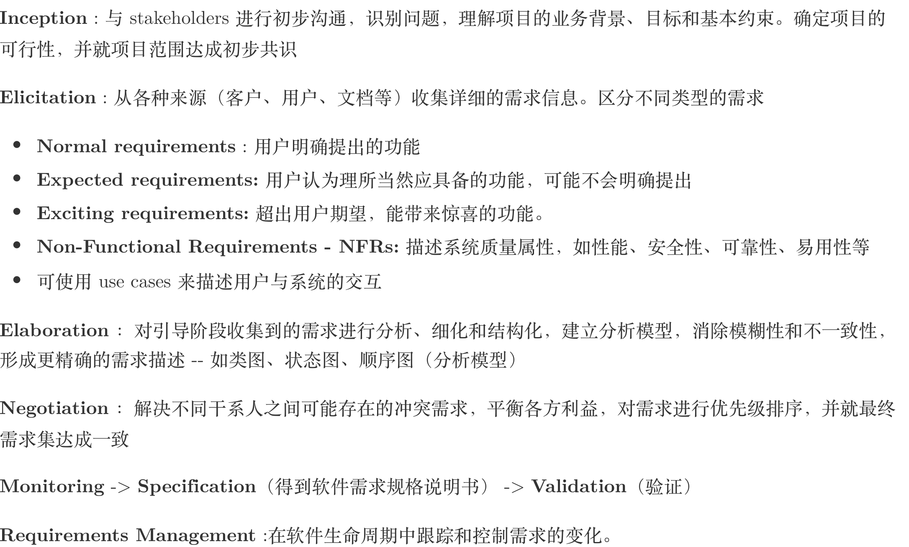

## SE-1 The Nature of Software

- 软件产品与传统工程产品制造方法不同
- 软件会退化(deteriote)而不是wear out
  - 唯一原因:持续变更 
- 如果遗留软件能满足用户需求且运行可靠，则无需立即修改。当必须进行重大变更的时候，需要对其进行reengineering

## SE-2 The Process of Software Engineering

- 软件工程层次
  - **process** 最重要
  - method
  - tools 
  - quality focus
- umbrella avtivities:包括**项目管理、质量保证、配置管理**等——贯穿整个项目生命周期，而不是只有开始阶段
- generic software framework:
  - **comunication**
  - planning
  - modeling
  - construction
  - deployment
- 软件开发能否成功主要看用户
  

## SE-3 The Process of Software Engineering

- process model的类型
  - linear model
  - iterative model
  - evolutionay model
  - parallel model(concurrent model)

- 软件过程评估标准 standard for assessing software process：【SPICE】、【ISO9001】、CBA API、SCAMPI

## SE-4 Process Models

- process model:为软件工程工作提供一个特定的路线图，定义了所有活动、动作和任务的流程、迭代程度、工作产品以及工作的组织方式
- waterfall model:基于 **linear model**，顺序开发
  - 适合用户 **需求明确**
- incremental model:每个增量都提交一个可运行产品
  - 主要优势：**快速构建核心产品**
- evolutionary model:基于 **iterative**的过程模型
  - 开发者和用户充分交流，适用于 **用户需求不明确**的情况
  - 可以适应需求的变化
  - 通常开发的不是一次性(throwaway)的产品
  - **prototype model**演化模型的一种，**早期可运行的版本**
    - 用户需求不明确时可以通过原型更好迭代
    - 原型不能交付
  - **spiral model**,演化模型的一种，在每个迭代中都增加了 **风险评估**
  - **concurrent model**:有时被称为 **concurrent engineering**
    - 定义触发工程活动状态转化的事件
- 其他模型
  - component-based model:reuse,依赖于 **object technology**
  - formal methods model:强调数学方法的使用
- **统一过程**：
  - inception:对应沟通和策划，识别业务需求，提出初步体系结构，制定迭代计划，创建初步用例
  - elaboration：对应沟通和建模。细化用例，扩展体系结构(**use-case model,analysis model,design model, implementation model, deployment model**)
  - construction:构建。分析、设计模型，实现代码，测试
  - transition：用户反馈，收集文档
  - production：部署，监控软件使用，提供运行环境支持，处理缺陷报告和变更请求
- TSP&PSP:
  - PSP：强调自我管理，不需要产品经理严格监督
  - TSP:
    - 帮助团队成员提升`self-directed`能力
    - 让专业人员更好地事件管理
    - **对加速软件过程没有帮助**

## SE-5 Agile Development

- 敏捷的特征
  - **Effective** reponse to change/communication
  - **Driven** by customers' requirement
  - **Self-organization**
  - **Rapid incremental delivery** of software
- 敏捷过程
  - 只产出必要的work product
  - 允许团队简化streamline tasks
  - 短时间增量交付产品
  - 逐步适应变化，**需求、风险分析不需要一开始非常明确给出**
- 敏捷宣言 Agile manifesto
  ‒ 人之间的**交流**胜过了开发过程和工具
  ‒ **可运行的软件**胜过了宽泛的文档
  ‒ **客户合作**胜过了合同谈判
  ‒ 对**变更的良好相应**胜过了按部就班的遵循计划
- XP:planning,design,coding,testing
- DSDM:80% 的应用功能可以在 20% 的开发时间内交付
- **敏捷建模**
  - 主要指导`analysis`和`design`而没有`coding`和`testing`
  - 目的：以有效和高效的方式对软件进行建模和文档化

!!! example

!!!

## SE-6 Human Aspects of Software Engineering

- 敏捷团队
  - 特点：自组织、跨职能、高度协作、快速响应变化
  - 通用敏捷团队：强调团队成员的自主性和集体决策
  - XP团队：通常规模较小，成员间紧密合作，如`pairing programming`

## SE8 Requirements Engineering

- 需求工程是一个通用的工程，不会因为软件项目的不同而变化
- **Quality Function Deployment (QFD)**
  - normal
  - expected
  - exciting
- **Non-Function Requirements(NFD)**
- 需求工程的三个问题域
  - information
  - functional
  - behaviral
- 需求验证不考察技术可行性

## SE-9 Requirements Modeling：Scenario-Based Methods

- 需求分析模型包括
  - senario-based elements
    - use-case model
    - activity model
  - class-based elements
    - 类图
    - CRC
  - behaviral elements
    - state diagram
  - flow-oriented element 
    - data flow diagram
- 需求建模策略
  - structured analysis:data/flow
  - OO analysis:class

- behavior modeling:
  - 事件:system 和 actor
  - 状态:observable mode of behavior
- WebApp interaction model
  - use-cases
  - sequence diagrams
  - state diagrams
  - interface prototype