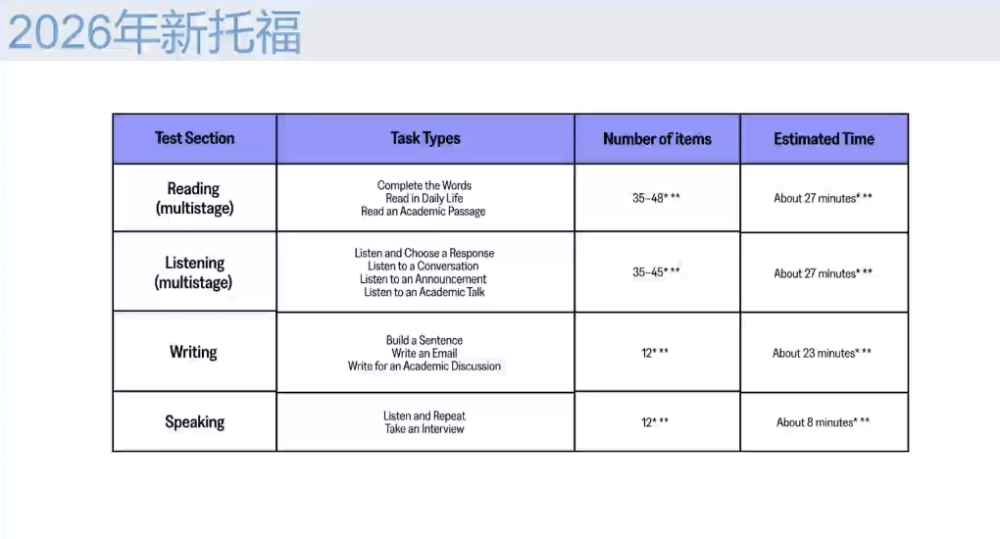
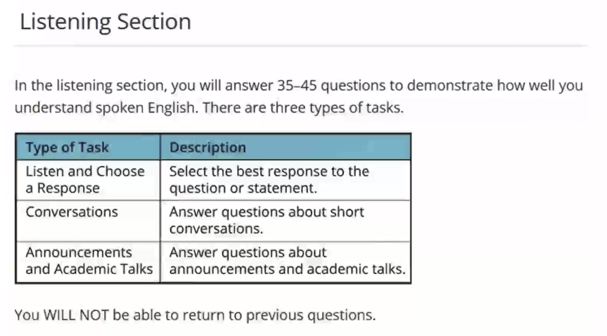
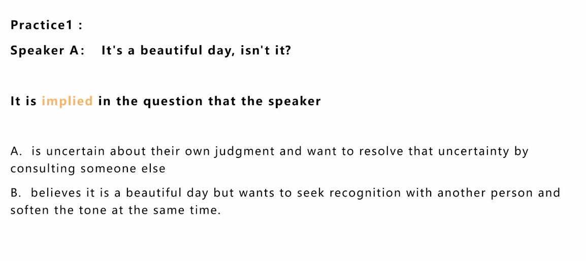
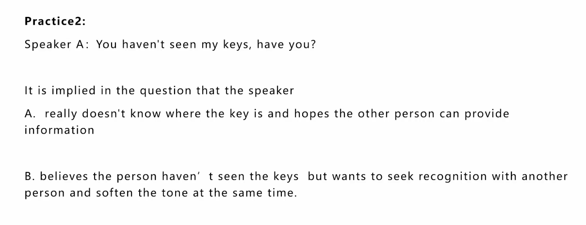
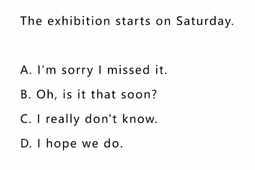
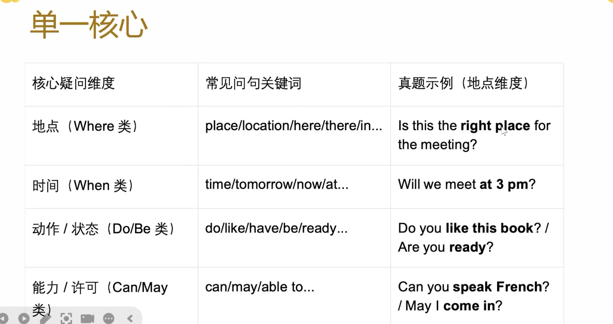
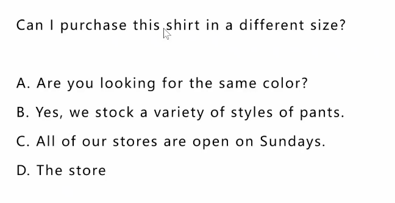
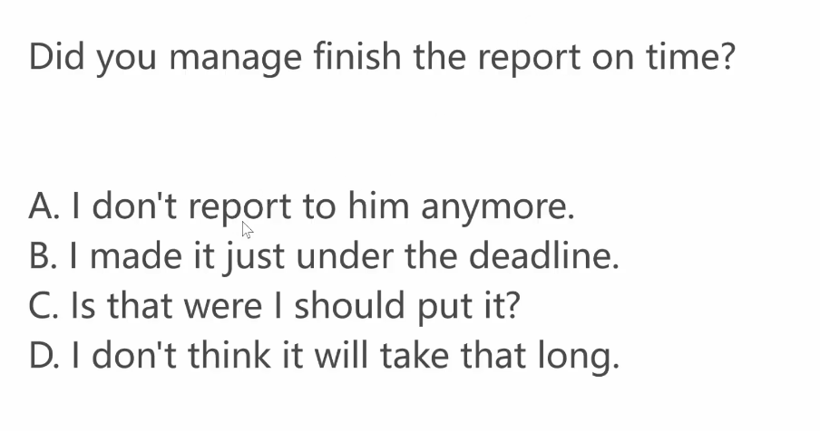
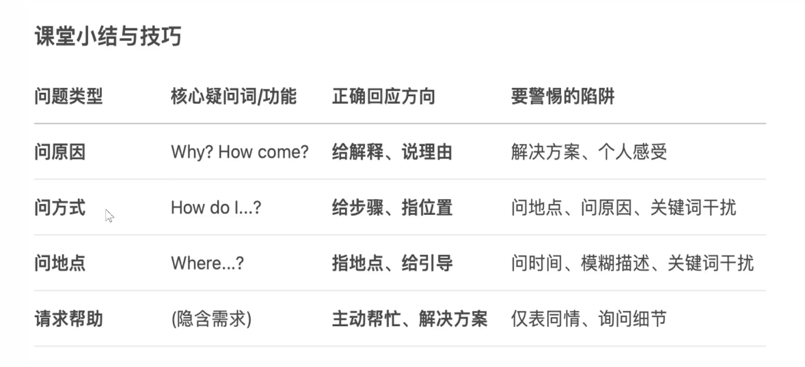

---
title: 托福听力
date: 2026-02-09 12:30:00
tags: [托福听力]
categories: [英语]
description: 托福听力逻辑建模指南：解析学术讨论语境下的语言输出矩阵。通过结构化模板与高频词汇包，优化你的考场应试算法，实现高分突破。
cover: https://www.cheersyou.com/sites/default/files/styles/news_show_2022/public/field/image/woman-girl-technology-music.jpg?itok=ICZSywRJ
--- 

## 1. Intro

- 考试时间：18-25分钟
- 题目数量：35-45 （在自适应阶段会变化）
- 自适应考试:Multistage Adaptive Listening 
  - Stage 1:Common set of tasks
  - Stage 2:Next set adjusts in difficulty based on performance

## 2. Listen and choose the best response

### 2.1 解题原则

- 建立意识、快问快答
- 确保听到，注意四词
  - 疑问词优先：what/why/how...
  - 话题词相关
  - 时间词辅助
  - 人称词
- 识别语用，识别答案
  - `asking for help`
  - `decline politely`:婉拒
  - `offering suggestions`
  - `showing uncertainty`
  - `giving confirmation`
  - `information check`
  - `clarification`
  - `apology`
  - `request`
  - `complain`
  - `invitation`
  - `hesitation&doubt`
  - `empathy`
- 语气时态，辅助排除

> 记笔记的时候记什么：疑问词+话题词+时间词+人称词

### 2.2 The main features of a response for a question

- direct or indirect
- on-topic
- fap-filling:its primary purpose os to provide the missing knowledge or details that the question sought

### 2.3 句型与语用

#### 1. 反义疑问句

> 寻求共情+表达不确定性

- 个人观点+反义疑问句/反问句——寻求共情
  - That movie was fantastic, wasn't it?
- 事件+反义疑问句/反问句——表达不确定性
  - Isn't the library hosting an event today?

!!! example

B 个人观点——寻求共情

A 事件描述——表达不确定性
!!!

#### 2. 陈述句

- 通知
  - 要点信息
    - 事件+时间
  - 答案要点
    - 时态对应（将来时 情态动词(can may must should could)+动词）
    - 事件相关（表示收到、不知道、评价、进一步询问相关信息）
- 建议
- 更改计划
  - 表达自己无法赴约
    - 询问可以更改的时间——优先找询问时间的疑问句
    - 表达理解(No worries, No problem. Thanks for letting me know.All good! Another tie then. it is understandable)
- 个人观点
- 提议
  - `Let's + do sth`
  - `subject + should/could/might + do sth`
  - `why don't we...`
  - 回答
    - 同意`that sounds fun, good idea`
    - 拒绝提议`I can't make it/I have another plans`
    - 新建议 `How about thae cafeteria on campus instead?`

!!! example

~~C~~ B C是一种在得知信息之后不礼貌的说辞，表示不知道**一定要用过去式**
!!!

#### 3. 一般疑问句

- 基础回答：`Yes`+`No`
  - 肯定回答：Yes + 主语 + 问号引导词(系动词/情态动词/助动词)
  - 否定回答：No + 主语 + not (可缩写)

**答题**

- 直接呼应型：选项是Yes/No
- 动作呼应型：选项是为了确认核心而做的合理动作
  - 如真题选项C查日程表->因为日程表有 会议地点，动作能帮确认核心疑问

!!! example

~~B~~ A 题目中问的是shirt，但是B选项中的答案是pants

~~D~~ B一定要注意时态，题目问的是过去式的是否完成
!!!

#### 4. 特殊疑问句

- 问原因
    - 常见疑问词：`Why/How come`
    - 正确选项的特点：直接、合理地解释原因
    - 常见陷阱选项
      - 提供解决方案
      - 表达个人感受
      - 无关信息
- 问方式方法
  - 常见疑问词：`How do I...?How can I...?What's the way to...?`
  - 正确选项特点：提供**清晰的步骤、指令或操作位置**
  - 常见陷阱选项
    - 回答地点(The admin building is next to the library,没有回答怎么去)
    - 回答原因(It's out of paper.解释为什么不能用，但是没有回答怎么用)
    - 关键词干扰
- 问地点/位置
  - 常见疑问词`where`
  - 正确选项特点：指出具体地点、方位或者主动提供引导
  - 常见陷阱选项
    - 回答时间
    - 描述物品（描述地点本身不能指明具体位置）
    - 关键词干扰
- 请求帮助
  - 常见表达：`can you help me with... ?I`. `I'm having trouble with...`,`What should I do about...?`
  - 正确选项特点
    - 主动提供帮助
    - 基础解决方案
    - 分担任务
  - 常见陷阱
    - 表示同情——无实际帮助
    - 询问细节——没有首先表示帮助的意愿
    - 无关建议

## 词汇积累

- `get back to sb on that`:稍后回复某人，属于**通用答案**，基本上都可以使用
- `sidetrack`:偏离
- `exercise mat`:瑜伽垫
- `wear out`:磨损、损耗、疲惫不堪
- `decent`:得体的、相当好的
- `auction`:拍卖
- `be thriied to do sth`:很想做某事,很高兴做某事
- `ethnocentrism`:民族中心主义
- `laptop`:笔记本电脑
- `craft`:工艺
- `improvisation`:即兴
- `power outage`:停电
- `garage`:车库
- `recipe`:菜谱
- `I can help with that`：我自己能行
- `appetizer`:开胃菜
- `be thrilled to do`:很激动地做某事
- `proceed`:收益
- `criteria`:标准(单数：`criterion`)
- `anthropologist`:人类学家
- `book fair`:书展