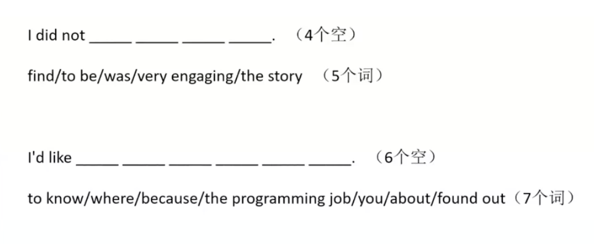
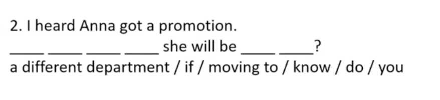
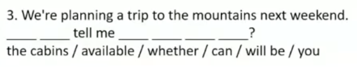
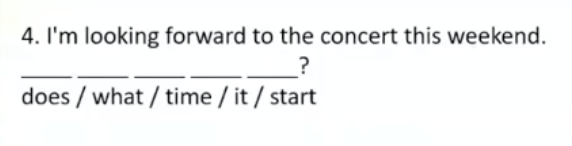
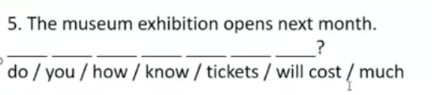
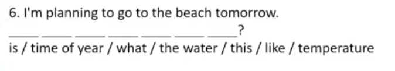
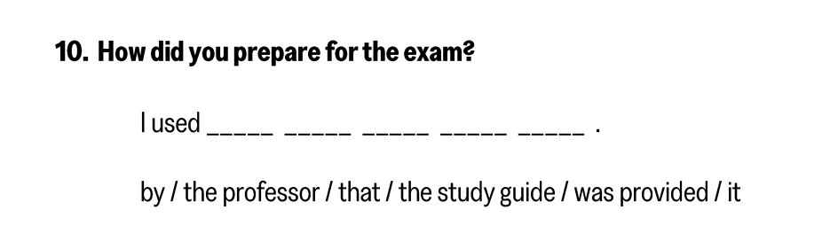

## 1 Build a sentence

### 1.1 分类

- 等额
 
- 按句子类型划分
    - 陈述句
    - 疑问句
    - 否定句
- 按结构复杂度划分
    - 简单句
    - 复杂句

### 1.2 答题方法

- 辨类型
  - 否定句/陈述句
  - 等额/差额
  - 简单句/复杂句
- 搭主干
  - 主谓宾
  - 主系表
- 补修饰
  - 注意语义和固定搭配
  - 补充剩余内容

!!! example
- `Luosifen is boiled`

- `Luosifen is boiled in soup`

- `Luosifen is boiled in a spiced river snail soup`

- `Luosifen is boiled with pickled bamboo shoots, dried turnips, fresh wegetables and peanuts in a spiced river snail soup`
!!!

## 2 Write an E-mail
## 3 Academic discussion

### 3.1 评分点

- content/opinion
- structure
 
- vocabulary
- syntax

### 3.2 Question Location

**位置+标点符号(问号) = 确定问题位置**

### 3.3 Classification

- Comparison: A和B你支持谁
- Evaluation:yes or No
- Solution:给出你的方案

### 3.4  写作主题确定

**Hierarchy of Human needs**

- 所有写作主题最终都指向人类行为的最终指向也就是人类的最终需求

- 最终维度：**有钱、有闲、开心幸福**

**"various cities vs one city"**
- various cities 
  - 钱：better job, better chance,better employment, higher salary, higher income
  - 闲：better job, more flexible, more time
  - 幸福：experience, culture, friends
- one city的优点
  - 钱:save money
  - 闲：save time
  - 幸福：stable

**Road construction vs Network Construction**
- Road construction:
  - 钱：tourism, better employment, higher income
  - 闲：save time
  - 幸福: convenience, health care, education
- network construction:
  - 钱: online industry, online employment
  - 闲：save time, commuting(通勤)
  - 幸福：convenience， online health care, online education

**Whether new ,innovation subjects should be taught in school**

- YES
  - 钱：skills, abilities, future employment
  - 开心：engaging, enjoy
- NO
  - 钱:heiher cost, financial burdens
  - 闲：no time
  - 开心:stress

### 3.5 Point and Elaboration

#### 1. 缔造主干

- `Point`:**科技发展是有利的**
  - `The rapid advancement of science and technology is beneficial`
- `Elaboration`:**可以促进人类发展**

- Lexicaon Bank:verbs
  - 促进(promote):The goverment's funding for space exploration could promote technological innovation
  - 改善(improve):Bicycle encouragement policies can improve pubblic health.
  - 加剧(exacerbate):Higher taxes on companies might exacerbrate economic inequality
  - 提升(enhance):Homework during breaks may enhance students' time management skills
  - 提升(boost):Small stores can boost local economies

- 如何给出全文的主干句
  - 先给出自己的观点
  - + as it/they could enhance the future development of ...

> 可以通过同义词替换的方式替换观点句(point)，避免与其他人重复内容太多

!!! example
**1.8大陆场**

`Consumers' online product views and purchase should be tracked by markets`

→

*Customers' online commodity browses and views ought to be monitored by marketers*

**1.11大陆场**
`New, innovative subjects should be taught in public schools, as they could enhance the future development of education`

→

*Emergent innocative curriculu, ought to be instructed in public schools, as they could enhance the future development of education*
!!!

#### 2. 完善修饰

**加形容词、副词**

##### Lexicon Bank：adjectives

1. 科技与社会变革 (Technology & Social Change)
 
**高频考题：**
 
- 1.5 消费者数据追踪、3.29A 购物决策依赖网络信息、3.22C 儿童追踪技术、2.19A 网红影响

**核心主体：**
 
- 技术手段：tracking algorithms（追踪算法）, digital surveillance（数字监控）, AI-driven analytics（AI驱动分析）
 
- 社会影响：privacy erosion（隐私侵蚀）, behavioral manipulation（行为操纵）, digital divide（数字鸿沟）

适配形容词：

▸ 技术特征： intrusive （侵入性的）,  innovative（创新的）, cutting-edge（前沿的）；
▸ 社会影响： pervasive （无处不在的）,   ethically ambiguous （道德模糊的）,   disruptive （非预期的）;

例句应用：
`While cutting-edge and innovative AI-driven surveillance systems demonstrate intrusive technical capabilities through their pervasive data collection, their ethically ambiguous design raises concerns about the disruptive societal consequences of unchecked digital monitoring.`
 

2. 教育与技能培养 (Education & Skill Development)
 
高频考题：
 
- 1.11A 创新学科、1.25A 软技能课程、3.15C 假期作业、2.22B 成人持续学习
核心主体：
 
- 课程设计：curriculum innovation（课程创新）, competency-based learning（能力本位学习）
 
- 技能类型：critical thinking（批判性思维）, digital literacy（数字素养）, emotional intelligence（情商）

适配形容词：
▸ 教育方法： student-centric （以学生为中心的）,  future-proof （面向未来的）,  holistic （全面的），
▸ 技能属性： innovative（创新性的）,  interdisciplinary （跨学科的）,  cognitively demanding （认知要求高的）

例句应用：
`By adopting student-centric, future-proof, and holistic pedagogical frameworks, modern educational systems aim to cultivate innovative, interdisciplinary, and cognitively demanding skills that empower learners to navigate evolving global challenges with adaptability and critical acumen.`

 
3. 经济与职场发展 (Economy & Career Dynamics)
 
**高频考题：**
 
- 1.11D 代际招聘、2.19B 非工作时间沟通禁令、3.15B 择业标准、2.22C 企业惩罚性税收
 
**核心主体**：
 
- 职场挑战：generational clashes（代际冲突）, automation threats（自动化威胁）, gig economy（零工经济）
 
- 经济政策：corporate taxation（企业税收）, labor regulations（劳动法规）, entrepreneurship incentives（创业激励）

**适配形容词：**

▸ 职场特征： hyper-competitive （高度竞争的）,  remote-friendly （适合远程办公的））,  burnout-inducing （导致倦怠的）
▸ 经济属性： sustainable （可持续的）,  globalized（全球化的）,  consumerist （消费主义的）

例句应用：

`In a globalized, consumerist economy shaped by relentless consumption demands, hyper-competitive, remote-friendly workplaces often become burnout-inducing, posing significant challenges to the adoption of sustainable business practices that balance productivity with employee well-being.`

 
4. 环境与可持续发展 (Environment & Sustainability)
 
高频考题：
 
- 2.19C 拥堵费、3.29C 航空环境税、3.1A 太空探索资金、2.15A 自行车政策
核心主体：
 
- 环境问题：carbon footprint（碳足迹）, resource depletion（资源枯竭）, biodiversity loss（生物多样性丧失）
 
- 解决方案：green taxation（绿色税收）, renewable energy adoption（可再生能源应用）, circular economy（循环经济）

适配形容词：
▸ 问题特征： irreversible （不可逆的）,  complex （复杂的）,  deteriorating （恶化的）
▸ 方案特征： sustainable （可持续的）,  renewable（可再生的）,  feasible （可行的）
例句应用：
"Confronted with irreversible, complex, and deteriorating ecological crises—such as biodiversity loss and climate change—policymakers must prioritize sustainable, renewable, and feasible strategies to halt degradation and foster a resilient planet for future generations."

 
5. 生活方式和心理健康 (Lifestyle & Mental Well-being)
 
高频考题：
 
- 2.15B 成绩奖励金钱化、1.25D 过度观赛影响、3.22C 儿童追踪、2.19A 网红效应
核心主体：
 
- 行为模式：screen addiction（屏幕成瘾）, materialism（物质主义）, social comparison（社会比较）
 
- 心理影响：anxiety triggers（焦虑诱因）, self-esteem erosion（自尊侵蚀）, FOMO（错失恐惧症）

适配形容词：
▸ 心理状态： uncertain（不确定的）， anxious （焦虑的）, detrimental （有害的）,  emotionally draining （情感消耗的）；

例句应用：
"The constant uncertainty of job security, coupled with detrimental social comparisons on social media, leaves many individuals feeling anxious and trapped in an emotionally draining cycle that erodes their mental resilience over time." 

#### 3. 表达观点

!!! example 
*Whether new, innovative subjects should be taught in public schools.*

- **缔造主干**：New innovative subjects should be taught in public schools, **as they could** enhance the future development of education.
- **升级词汇**：**Emergent**, **creative criculumn** ought to be instructed in public schools, as they could enhance the future development of education. 
- **完善修饰**:**I firmly adovate the propoition** that emergent, creative curriculumn ought to be **reasonably** instructed in public schools, as they could **profoundly** enhance the **innovative** future development of **holistic** education.
- **完善修饰帽子**：**As far as I am concerned,** **I firmly adovate the propoition** that emergent, creative curriculumn ought to be **reasonably** instructed in public schools, as they could **profoundly** enhance the **innovative** future development of **holistic** education. 
!!!

### 3.6 Corpus

#### 1. Money/Economy

- `save money`
  - individual
    - optimize(personal) spendign:优化支出
    - reduce(daily) cost：节省成本
    - economize on (daily) expenses：
    - manage (persoanl) finances frugally
  - nation/government/enterprise
    - optimize(national) spending
    - reduce(operational) cost
    - economize on (operational) expenses
    - manage(national) finances frugally(节俭地、节约地)
- More money
  - individual
    - increase earnings
    - increase salaries
    - elevate income levels
    - augment income/salary
  - nation/government/enterprise
    - generate/maximize/boost/enhance/raise national income
    - earn profits
    - expand fiscal revenue
    - increase industrial output

#### 2. Time/Effciency

- save time 
  - individual
    - optimize(personal) time utilization
    - streamline(personal)time utilization
    - reduce/decrease/minimize (personal) time expenditure
  - nation/government/enterprise (基本与individual相似)
- Higher efficiency
  - individual
    - enhance/maximize/boost/improve (personal) efficiency optimize processes
  - nation/government/enterprise  
    - enhance/maximize/boost/improve (national) efficiency 
    - optimize processes
    - accelerate optimization
    - enhance/maximize/boost/improve (national) productivity

!!! example "你是否会在同一个城市过一生"
**To be more specific,** **initially**, residing in various cities enables people to **increase earnings**, as it provides more promising job prospects and superior career opportunities.

**Additionally**, living in different cities can **enhance people's horizons**, since they get to experience diverse cultures and broaden their outlook on life.
!!!

!!! example "Are these international organization effective at addressing global challenges?"

As far as I am concerned, I **firmly** advocate the prossposition that international organizations are ~~effective~~ **considerably** competent at ~~addressing~~ dealing with ~~global challenges~~ **sophisticated** worldwide issues, as they could **profoundly** enhance the **sustainable** future development of ~~humanity~~ global community.

**Further Elaboration**

To be more specific, initially, organizations play an effective role in dealing with global issues since they can boost the income of developing countries and help relieve poverty. Additionally, these global institutions contribute to solving worldwide problems, as they improve social welfare and enhance the overall well-being of citizens in many nations.
!!!

!!! example
*Some argue that free will is an illusion and that our choicees are determined by factors beyond our control. Others believe that individuals have the ability to make free choices regardless of external influences. What is your opinion?*

**观点**

- 缔造主干：Free will is an illusion and that our choices are determined by factors beyond our control, as this could hinder the future development of subjective initialtive.
- 升级词汇：Subjective intialtive is a delusion and that our decisions are influences by elements beyond our control, as this could hinder the future development of subjective initialtive.
- 完善修饰——形容词副词：Subjective intialtive is a delusion and that our decisions are influences by external elements beyond our control, as this could hinder the sustainable future development of self-growth.
- 完善修饰——观点：As far as I am concerned, I firmly advocate the proposition that subjective intialtive is a delusion and that our decisions are influences by external elements beyond our control, as this could hinder the sustainable future development of self-growth.

**论证段**

To be more specific, initially, through personal intiative, we can strice to improve iur careers and increase wealth by our own efforts, which free us from being controlled by external conditions. Additionally, free will sshape our well-being: we can choose positive attitudes toward life, and happiness mainly depends on our own choices, not outside influences.
!!!

### 3.7 Illustration

- Example
  - story
  - case study
  - personal experience
  - historical facts
- Statistical data
- Research results

!!! warning
细节才是重中之重，一定要在文章中体现出细节
!!!

!!! example
*Which is the better strategy for making purchasing decisions, relying on advice from friends and family, or depending on information from online sources?*

- **cause**: When purchasng an oven
- **process**:I first reciewed product evaluations on   `rednote`, then studied operational tutorials on `Bilibili`, compared prices and finally bought one on `Taobao`.
- **result**:The detailed and professional online information o`ptimized` my decisin-making, `saving both time and money`.
!!!

!!! example
*Whether new, innvative subjects should be taught in public schools*

- **起因**：For illustration, consider a student. Leo, who took artificial intelligence courses in public school.
- **经过**：He acquired practical skills that greatly strengthen his competitiveness in future employment in tech corporations. Meanwhile, these courses were engaging and brought him great pleasure in learning.
- **结果**：which fully proves that innovative subjects benefit students' career development and personal well-being.
!!!

!!! example "Hiring experienced vertans or younger employees"
- **起因**：For illustration, my cousinEthan runs a small digital marketingcompany that focus on online brand promotion. He hired young employees whho have sharp creative thinking.
- **经过**：Their relatively low salaries helped cut the company's labor by 15%. Meanwhile, their new ideas increased customer engagement by 30% and released sales by 20% within six months.
- **结果**：This example clearly shows that young employees can reduce costs and fuel corporate innovation.
!!!

!!! example "Do you think that more cities should make their central zones car-free"

- **起因**：For illustration, Shanghai has not introduced  car-free politics in its city center.
- **经过**：if such rules were carried out, hsops, restaurants and drivers who rely on  convenient traffic would suffer heavy economic issues. Meanwhile, residents would spend much more time commuting, causing great inconvenience.
- **结果**：This clearly shows that car-free zones would harm business and people's well-being.

!!!

!!! example "Do you think digital nomadism is likely to continue increasing"

**For illustration, Leo, a freelance online tutor, once worked in an expensive city and spent most of his salary on rent.**

Now he works remotely in low-cost areas and saves a lot of money. He also enjoys flexible hours and can combine work with travel. This makes his life more relaxing and enjoyable.

Clearly， digital nomadism reduces and improve personal well-being.
!!!

### 3.8 Concesssion and Refutation

- `concession`: Admitting that another person is right about something
- `refutation`: Proving that someone else is wrong about something

#### 1. A or B

!!! example 
- `ordinary people`:**While acknowledging the benefit that** asking celebrities, famous entertainers, or sports figures to promote their products could **bring a sense of happiness of adoring celebrities.** **Neverthless**, **the superiority of** to have ordinary people talk about the product **lies in** improving advertising profit and efficiency, **makig it the preferable choice**.
- `celebrities`:While acknowledging the benefit that having ordinary people talk about the product could bring a more down-to-earth vibes.
!!!

!!! example 
*Which do you think contributes more to a person's health and happiness:spending time with a close-knit few or a larger group of friends?*

While acknowledging the benefit that a large group of friends can bring more excitement and social opportunities, nevertheless, the superority of spending time with a close-knit few lies in deeper trust and emotional support, making it a preferable choice.
!!!

#### 2. Yes or No

- `Which acknowledging the concern that X harms/affects...`
- `Which acknowledging the benefit that X improves/promotes...`

!!! example
**Yes**

Admittedly（诚然）, while acknowledging the concern that rapid advancement of science harms/affects morality and environment. Nevertheless, its benefits in improving/promoting economy and efficiency **far outweigh these concerns, thus making it imperative**.

**No**

Admitted;y, while acknowledging the benefit that rapid advancement of science improves/promotes economy and efficiency. Neverthless, its concerns in harming/affecting morality and environment far outweigh these benefits, thus making it imperative.
!!!

!!! example
*Do you think that more cities should make their central zones car-free?*

Admittedy, while acknowledgeing the benefit that central zones car-free can reduce pollution and traffic noise, nevertheless, its concerns in inconvenience and negative impacts on local businesses far outweigh these benefits, thus makinng it unwarranted.
!!!

!!! example
*Do you think high schools should implement mandatory evening classes*

Admittedly, while acknowledging the concern that mandatory evening classes puts more pressure on students and leaves less free time for them. Nevertheless, its benefits concentrating more energy and attention on study and push them to keep forward far outweigh these benefits, thus making it imperative.
!!!

#### 3. How

> 给出你的solution,与`A or B`类型的区别在于需要自己给出A，B这两种解决方案

- **imaginary enemy**

*Admittedly, **while ackowledging the benefit that** financial subsides could do some extent encourage people to live in rural areas. **Neverthless, the superiority of** construction of suburban infrastructure **lies in** improvin/promoting a sense of happiness and security, **making it the preferable choice**.*

## 4 Word Choice and Hedging

### 4.1 Word Choice

- 不具描述性的词语：`thing`,`happy`, `good`,`big`,`nice`, `bad`
- 更具体的词语：`phenomenon` or `concept`,`effective`, `beneficial`, `significant`, `substantial`, `commendable`, `specific`, `sad`, `heart-breaking`
- 模糊→清晰

#### 2. Hedging（模糊陈述）

- 绝对化的语言体系
  - clickbait
  - slogan
  - small talks
  - advertising

**Methods**

- 忽略了可能性 
  - 使用情态动词(modal verbs)和情态短语(modal phrases),如可能(might)，可以(could)等
  - 使用修饰词(modifiers) ,如可能的(possible),可能地(potentially)等，来修饰陈述并减少绝对性
- 忽略了条件
  - 使用条件句(conditional sentences)，如如果(if), 除非(unless)等，来表示某种条件下的可能性或不确定性

## 词汇积累

- African American:黑人
- `assignment in subject`:学科作业
- `nomad`:流浪者，游民
- `rising emergent tendency`: 日益增强的新兴趋势
- `burnout`:倦怠
- `veterans`: 老兵、经验丰富的人
- `financial subsidies`:津贴
- `elaboration`:阐述
- `prospective`:未来的、预期的，比future更正式
- `hinder`:妨碍
- `impete`:阻止
- `economical` = `cost-effective`
- `fiscal revenue`:财政收入
- `streamline`:使效率更高；精简；使合理化
- `running tally`:流水账
- `unwarranted`:未经授权的,没有正当理由的
- `morality`:道德
- `hedge`:树篱、规避风险

## 练习

### Test 1

#### 1. module 1

> Do you know if she will be moving to a different department?

> Whether can you tell me the cabins will be available?

> What time does it start?

> Do you knoe how musch does tickets will cost?

> What is the water temperature like this time of year?

> She wanted to know where she could buy a copy

> I used ~~it by~~(一定要注意填入与给出数量的对应关系) the the study guide that was provided by the study guide?

#### 2. Module 2

*Do you think digital nomadism is likely to continue increasing?*

- Support 
  - Money:save a lot on rent, cost-effective, financially, rising emergent tendency
  - Time:no longer wasting time on commuting, flexible
  - WELL-BEING:more fulfiled mental, burnout

- OPPOSE
  - MONEY:financial stress, not everyone can afford this lifestyle long term
  - TIME:less free time than expected
  - WELL-BEING:mental well-being, lonely, anxiety

*Is offering personalization essential for modern business*

- Support
  - Money:to customers' demand
  - Time:save customers' time
  - Well-Being:feel special and valued
- Oppose
  - Money:expensive
  - Time:time-consuming(采集客户信息)
  - Well-Being:privacy

*Should companies focus their business development on the local market or prioritize expanding into the international market*

- Local market
  - Money:cost-effective, higher profits
  - Time:time-saving,
  - Well-being:boost local employment, more satisfying, community
- International market
  - Money:expand market, higher profits,
  - Well-Being:creative, innovative

