## 1 Build a Sentence（句子构建）

### 1.1 分类

#### 按句子类型划分
- 陈述句
- 疑问句
- 否定句

#### 按结构复杂度划分
- 简单句
- 复杂句

### 1.2 答题方法

- **辨类型**
  - 否定句/陈述句
  - 等额/差额
  - 简单句/复杂句
- **搭主干**
  - 主谓宾
  - 主系表
- **补修饰**
  - 注意语义和固定搭配
  - 补充剩余内容

!!! example
- `Luosifen is boiled`
- `Luosifen is boiled in soup`
- `Luosifen is boiled in a spiced river snail soup`
- `Luosifen is boiled with pickled bamboo shoots, dried turnips, fresh vegetables and peanuts in a spiced river snail soup`
!!!

## 2 Write an E-mail（邮件写作）

### 2.1 写作思路

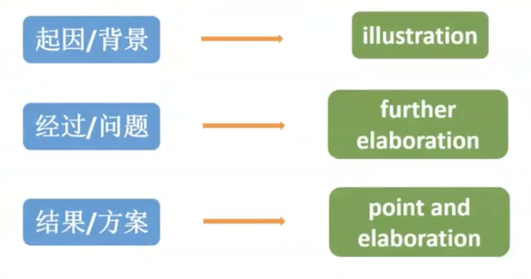

### 2.2 写作流程

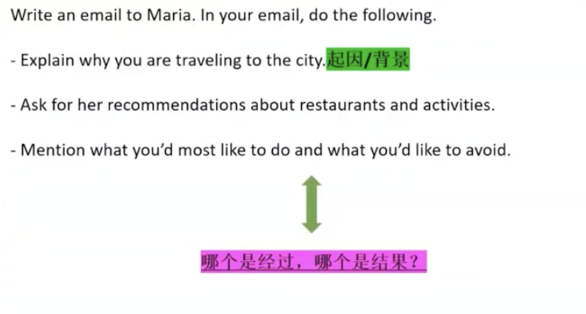
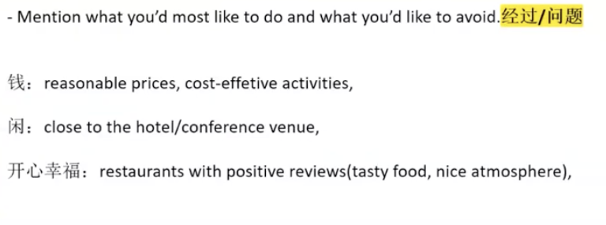

### 2.3 开头问候&寒暄

- **正式场景**：收件人是编辑、教授、陌生同事
  - `Dear..., I hope this email finds you well.`
  - `Dear..., I trust you are having a productive week.`
- **半正式场景**：收件人是同学、熟悉的同事
  - `Hi..., hope you're doing great.`
  - `Hey..., just wanted to reach out about...`
  - `Hi..., how's everything going with you lately?`

### 2.4 结尾礼貌用语

- **感谢类**：适用于咨询、请求类邮件
  - `Thank you in advance for your help and insights.`
  - `I really appreciate your time and recommendations.`
  - `Your advice would be incredibly helpful - thank you so much.`
  - `I'm grateful for any guidance you can provide.`
- **期待回复类**：适用于反馈、跟进类邮件
  - `Looking forward to hearing from you soon.`
  - `Please feel free to reach out if you need more details.`
  - `I'd be happy to clarify anything further - just let me know.`
  - `Hoping to get your response at your earliest convenience.`

### 2.5 添加语料

!!! example 
*You have been working on a group project with several for a course. One of your group members, Alex, has not been particcipating actively and has missed several assignments. You want to address this issue and find a solution.*

I'm writing to address your participation issue in our group and to find a solution.

We've been working on our course project - a marketing plan for a local cafe - and the team has finished 60% of the work, including survey design and customer feedback analysis.

First, your absence would lead to group missing out the course scholarship - evaluation depends on full participation, because team work is a key requirement.

Second, your lack of involvement has significantly added to the stress of the other group members, as we've had to take on your share of the work alongside our own course load.

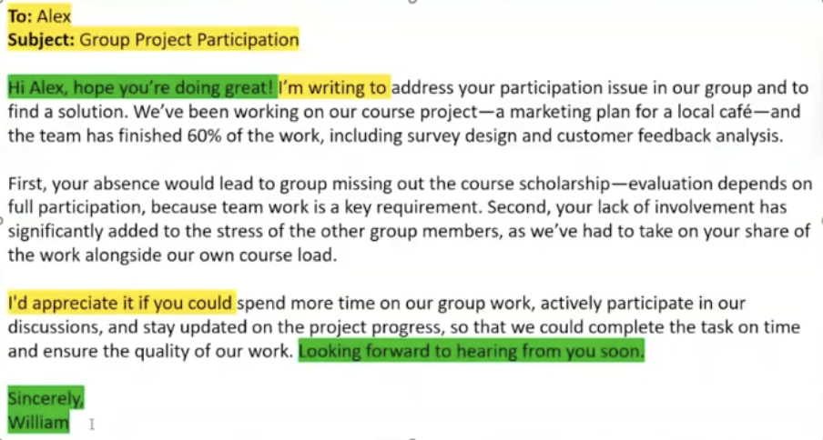
!!!

!!! example 
*You are planning a business trip to another city. Your colleague, Maria, recently traveled to the same city for work. You want to ask her recommendations for places to eat and things to do during your free time.*

**Brainstorming**:  Mention what you'd most like to do and what you'd like to avoid.

- 钱：reaonable prices, cost-effective activities
- 闲：close to the hotel/conference venue
- 开心幸福：restaurants with positive reviews(tasty food, nice atmosphere)

**定格式**

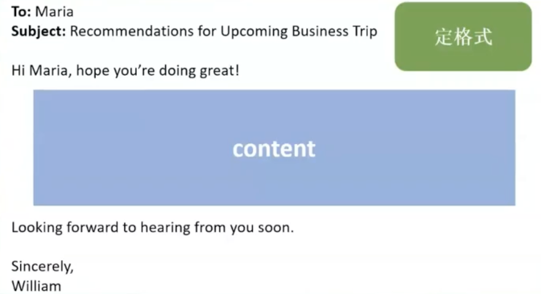

I'm writing to ask for your recommendatioons about restaurants and activities in Paris, where I will be travelling during Christmas week for a business trip related to haute couture fashion(高定时装).While the official haute couture shows typically take place in January and July, I will be attending meetings and events that connect to the the industry and I would love to explore the city's festival offerings during my free time.

Also, I prefer places close to the conference venue - specifically around the **Champs-Elysées** - so I can save time on travel and make the most of my breaks. A restaurant or spot within a **10-minute walk** from the venue would be ideal, as it won't **cut into my meeting schedule**.

Additionally, I'm looking forward for restaurants with positive reviews: ones that serve tasty food (especially authentic French cuisine or creative twists on classics) and have a warm, inviting atmosphere. I'm open to both Michelin-starred establishments and beloved local gems, but I'd like to avoid overly loud or overcrowded places that might hinder relaxation.

**I'd appreciate it if you could** your recommendations soon, **so that** I can plan my free time well - enjoying  tasty French food in a nice atmosphere while staying close to the Champs-Elysées venue. Looking forward to hearing from you soon.
!!!

## 3 Academic Discussion（学术讨论）

### 3.1 评分点

- content/opinion
- structure
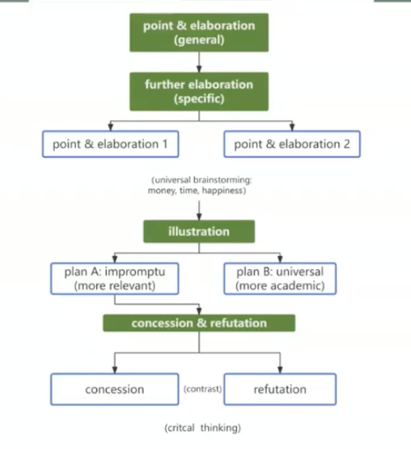
- vocabulary
- syntax

### 3.2 Question Location（问题定位）

**位置 + 标点符号(问号) = 确定问题位置**

### 3.3 Classification（题型分类）

- **Comparison**：A和B你支持谁
- **Evaluation**：Yes or No
- **Solution**：给出你的方案

### 3.4 写作主题确定（三维分析法）

**所有写作主题最终都指向人类行为的终极需求**

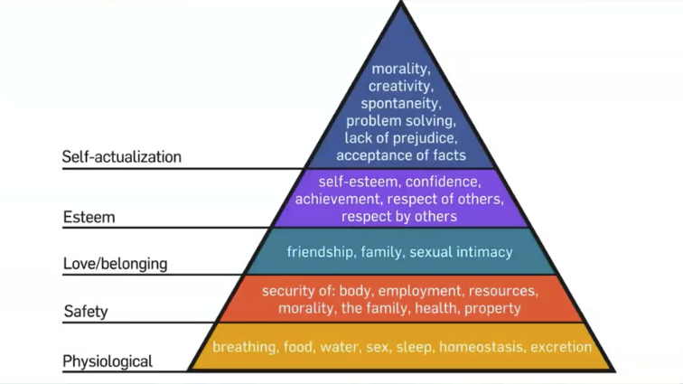

**核心三维**：**有钱、有闲、开心幸福**

**题目可能涉及的五大方向**

- 科技与社会变革
- 教育与技能培养
- 经济与职场发展
- 环境与可持续发展
- 生活方式与心理健康

#### 题型示例：various cities vs one city

| 维度 | various cities | one city |
|------|---------------|----------|
| 钱 | better job, better chance, higher salary, higher income | save money |
| 闲 | better job, more flexible, more time | save time |
| 幸福 | experience, culture, friends | stable |

#### 题型示例：Road construction vs Network Construction

| 维度 | Road construction | Network Construction |
|------|-------------------|---------------------|
| 钱 | tourism, better employment, higher income | online industry, online employment |
| 闲 | save time | save time, commuting |
| 幸福 | convenience (医疗、教育), health care, education | convenience, online health care, online education |

#### 题型示例：Whether new, innovation subjects should be taught in school

| 观点 | 钱 | 闲 | 幸福 |
|------|----|----|------|
| YES | skills, abilities, future employment | — | engaging, enjoy |
| NO | higher cost, financial burdens | no time | stress |

### 3.5 Point and Elaboration

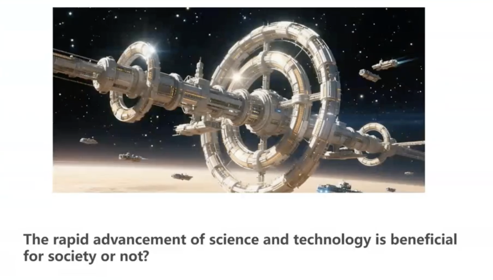

#### 1. 缔造主干

- `Point`:**科技发展是有利的**
  - `The rapid advancement of science and technology is beneficial`
- `Elaboration`:**可以促进人类发展**

!!! note 
`Point`往往是来自题干的
!!!

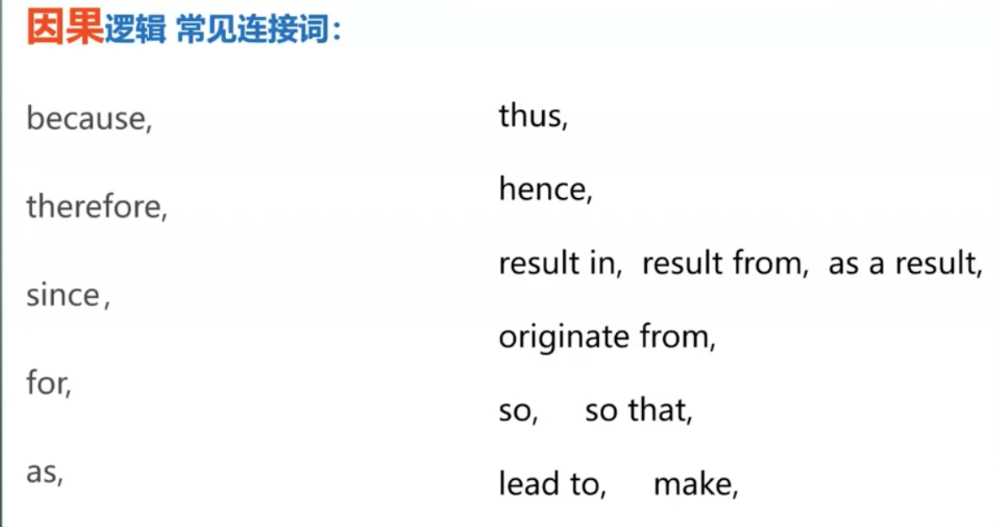

- Lexicaon Bank:verbs
  - **促进(promote)**:The goverment's funding for space exploration could promote technological innovation
  - **改善(improve)**:Bicycle encouragement policies can improve pubblic health.
  - **加剧(exacerbate)**:Higher taxes on companies might exacerbrate economic inequality
  - **提升(enhance)**:Homework during breaks may enhance students' time management skills
  - **提升(boost)**:Small stores can boost local economies

- 如何给出全文的主干句
  - 先给出自己的观点
  - + as it/they could enhance the future development of ...

> 可以通过同义词替换的方式替换观点句(point)，避免与其他人重复内容太多

!!! example
**1.8大陆场**

Consumers' online product views and purchase should be tracked by markets

→

*Customers' online commodity browses and views ought to be monitored by marketers, as it could enhance the future development of online marketing*

**1.11大陆场**
New, innovative subjects should be taught in public schools, **as they could** enhance the future development of education

→

*Emergent innovative curriculums, ought to be instructed in public schools, as they could enhance the future development of education*
!!!

#### 2. 升级词汇+完善修饰

!!! example
This advancement of science and technology is beneficial, because it can improve the future development of human.

→

*This progress of science technology is advantageous, as it could enhance the prospective development of humanity.*

Enterprises should hire experienced veterans, as this could enhance the future development of workplace.

→

*Corporations ought to employ skilled/seasoned/professionals, as they could enhance the future development of workplace.*
!!!

**加形容词、副词**

##### Lexicon Bank：adjectives

**1. 科技与社会变革 (Technology & Social Change)**
 
**高频考题：**
 
- 1.5 消费者数据追踪、3.29A 购物决策依赖网络信息、3.22C 儿童追踪技术、2.19A 网红影响

**核心主体：**
 
- 技术手段：tracking algorithms（追踪算法）, digital surveillance（数字监控）, AI-driven analytics（AI驱动分析）
 
- 社会影响：privacy erosion（隐私侵蚀）, behavioral manipulation（行为操纵）, digital divide（数字鸿沟）

适配形容词：

▸ 技术特征： intrusive （侵入性的）,  innovative（创新的）, cutting-edge（前沿的）；
▸ 社会影响： pervasive （无处不在的）,   ethically ambiguous （道德模糊的）,   disruptive （非预期的）;

例句应用：
**While cutting-edge and innovative AI-driven surveillance systems demonstrate intrusive technical capabilities through their pervasive data collection, their ethically ambiguous design raises concerns about the disruptive societal consequences of unchecked digital monitoring.**
 

**2. 教育与技能培养 (Education & Skill Development)**
 
高频考题：
 
- 1.11A 创新学科、1.25A 软技能课程、3.15C 假期作业、2.22B 成人持续学习
核心主体：
 
- 课程设计：curriculum innovation（课程创新）, competency-based learning（能力本位学习）
 
- 技能类型：critical thinking（批判性思维）, digital literacy（数字素养）, emotional intelligence（情商）

适配形容词：
▸ 教育方法： student-centric （以学生为中心的）,  future-proof （面向未来的）,  **holistic** （全面的），
▸ 技能属性： **innovative**（创新性的）,  interdisciplinary （跨学科的）,  cognitively demanding （认知要求高的）

例句应用：
`By adopting student-centric, future-proof, and holistic pedagogical frameworks, modern educational systems aim to cultivate innovative, interdisciplinary, and cognitively demanding skills that empower learners to navigate evolving global challenges with adaptability and critical acumen.`

 
**3. 经济与职场发展 (Economy & Career Dynamics)**
 
**高频考题：**
 
- 1.11D 代际招聘、2.19B 非工作时间沟通禁令、3.15B 择业标准、2.22C 企业惩罚性税收
 
**核心主体**：
 
- 职场挑战：generational clashes（代际冲突）, automation threats（自动化威胁）, gig economy（零工经济）
 
- 经济政策：corporate taxation（企业税收）, labor regulations（劳动法规）, entrepreneurship incentives（创业激励）

**适配形容词：**

▸ 职场特征： hyper-competitive （高度竞争的）,  remote-friendly （适合远程办公的））,  **burnout-inducing （导致倦怠的**）
▸ 经济属性： sustainable （可持续的）,  globalized（全球化的）,  consumerist （消费主义的）

例句应用：

`In a globalized, consumerist economy shaped by relentless consumption demands, hyper-competitive, remote-friendly workplaces often become burnout-inducing, posing significant challenges to the adoption of sustainable business practices that balance productivity with employee well-being.`

 
**4. 环境与可持续发展 (Environment & Sustainability)**
 
高频考题：
 
- 2.19C 拥堵费、3.29C 航空环境税、3.1A 太空探索资金、2.15A 自行车政策
核心主体：
 
- 环境问题：carbon footprint（碳足迹）, resource depletion（资源枯竭）, biodiversity loss（生物多样性丧失）
 
- 解决方案：green taxation（绿色税收）, renewable energy adoption（可再生能源应用）, circular economy（循环经济）

适配形容词：
▸ 问题特征： irreversible （不可逆的）,  complex （复杂的）,  deteriorating （恶化的）
▸ 方案特征： sustainable （可持续的）,  renewable（可再生的）,  feasible （可行的）
例句应用：
`Confronted with irreversible, complex, and deteriorating ecological crises—such as biodiversity loss and climate change—policymakers must prioritize sustainable, renewable, and feasible strategies to halt degradation and foster a resilient planet for future generations.`

 
**5. 生活方式和心理健康 (Lifestyle & Mental Well-being)**
 
高频考题：
 
- 2.15B 成绩奖励金钱化、1.25D 过度观赛影响、3.22C 儿童追踪、2.19A 网红效应
核心主体：
 
- 行为模式：screen addiction（屏幕成瘾）, materialism（物质主义）, social comparison（社会比较）
 
- 心理影响：anxiety triggers（焦虑诱因）, self-esteem erosion（自尊侵蚀）, FOMO（错失恐惧症）

适配形容词：
▸ 心理状态： uncertain（不确定的）， anxious （焦虑的）, **detrimental** （有害的）,  emotionally draining （情感消耗的）；

例句应用：
`The constant uncertainty of job security, coupled with detrimental social comparisons on social media, leaves many individuals feeling anxious and trapped in an emotionally draining cycle that erodes their mental resilience over time.`

#### 3. 表达观点

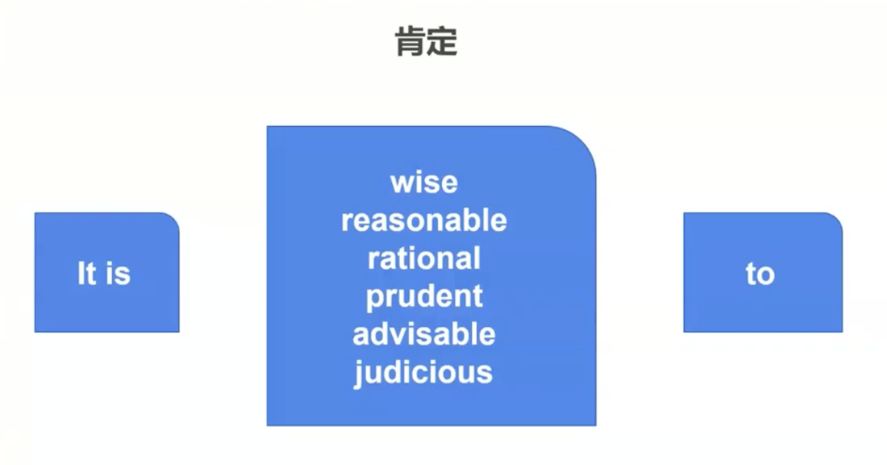
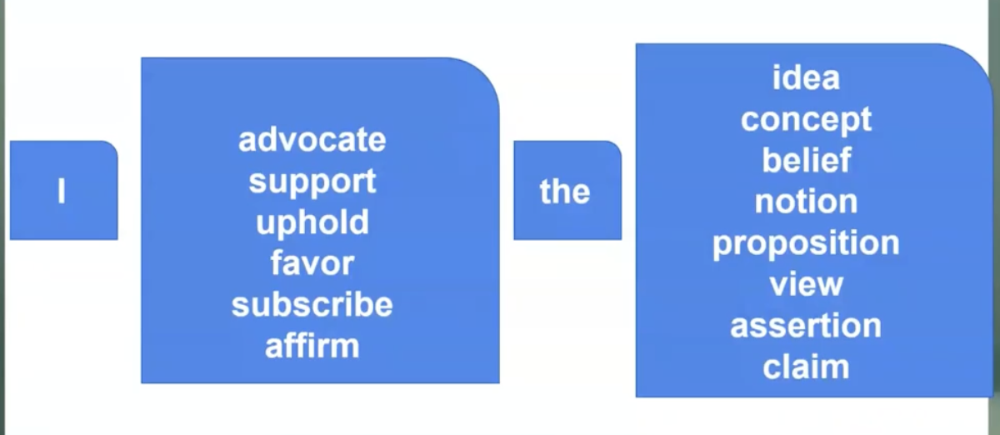

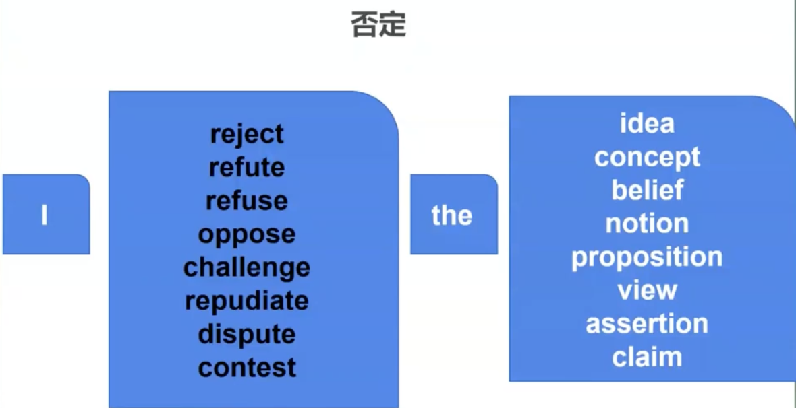

!!! example 
*Whether new, innovative subjects should be taught in public schools.*

- **缔造主干**：New innovative subjects should be taught in public schools, **as they could** enhance the future development of education.
- **升级词汇**：**Emergent**, **creative criculumn** ought to be instructed in public schools, as they could enhance the future development of education. 
- **完善修饰**:**I firmly adovate the propoition** that emergent, creative curriculumn ought to be **reasonably** instructed in public schools, as they could **profoundly** enhance the **innovative** future development of **holistic** education.
- **完善修饰帽子**：**As far as I am concerned,** **I firmly adovate the propoition** that emergent, creative curriculumn ought to be **reasonably** instructed in public schools, as they could **profoundly** enhance the **innovative** future development of **holistic** education. 
!!!

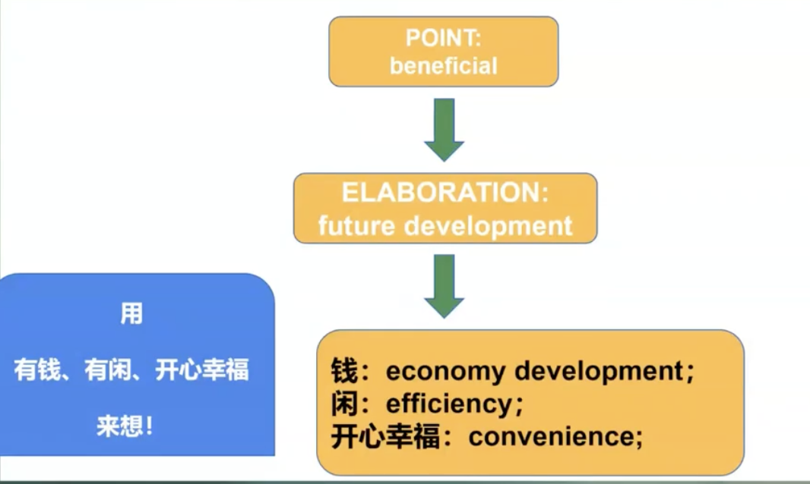

### 3.6 Corpus（语料库）

#### 3.6.1 Money/Economy（金钱/经济）

- `save money`
  - individual
    - optimize(personal) spending:优化支出
    - reduce(daily) cost：节省成本
    - economize on (daily) expenses：节省日常开支
    - manage(persoanl) finances frugally:节俭地管理个人财务
  - nation/government/enterprise
    - optimize(national) spending
    - reduce(operational) cost
    - economize on (operational) expenses
    - manage(national) finances frugally(节俭地、节约地)
- More money
  - individual
    - increase earnings
    - increase salaries
    - elevate income levels
    - **augment income/salary**
  - nation/government/enterprise
    - generate/maximize/boost/enhance/raise national income
    - earn profits
    - **expand fiscal revenue**:增加财政收入
    - increase industrial output

#### 3.6.2 Time/Efficiency（时间/效率）

- save time 
  - individual
    - **optimize(personal) time utilization**
    - streamline(personal)time utilization
    - reduce/decrease/minimize (personal) time expenditure
  - nation/government/enterprise (基本与individual相似)
- Higher efficiency
  - individual
    - **enhance/maximize/boost/improve** (personal) **efficiency** 
    - **optimize processes**
  - nation/government/enterprise  
    - enhance/maximize/boost/improve (national) efficiency 
    - optimize processes
    - **accelerate optimization**
    - enhance/maximize/boost/improve (national) productivity

!!! example "你是否会在同一个城市过一生"
**To be more specific,** **initially**, residing in various cities enables people to **increase earnings**, as it provides more promising job prospects and superior career opportunities.

**Additionally**, living in different cities can **enhance people's horizons**, since they get to **experience diverse cultures and broaden their outlook on life**.
!!!

!!! example "Are these international organization effective at addressing global challenges?"

**As far as I am concerned**, **I firmly advocate the prossposition that** international organizations are ~~effective~~ **considerably** competent at ~~addressing~~ dealing with ~~global challenges~~ **sophisticated** worldwide issues, as they could **profoundly** enhance the **sustainable** future development of ~~humanity~~ global community.

**Further Elaboration**

**To be more specific**, **initially**, organizations **play an effective role in dealing with global issues since** they can **boost the income of developing countries** and **help relieve poverty**. **Additionally**, these global institutions **contribute to** solving **worldwide problems**, as they improve social welfare and enhance the overall well-being of citizens in many nations.
!!!

!!! example
*Some argue that free will is an illusion and that our choicees are determined by factors beyond our control. Others believe that individuals have the ability to make free choices regardless of external influences. What is your opinion?*

**观点**

- 缔造主干：Free will is an illusion and that our choices are determined by factors beyond our control, as this could hinder the future development of subjective initialtive.
- 升级词汇：**Subjective intialtive** is a **delusion** and that our decisions are influences by elements beyond our control, **as this could hinder the future development of subjective initialtive**.
- 完善修饰——形容词副词：Subjective intialtive is a delusion and that our decisions are influences by **external** elements beyond our control, as this could hinder the **sustainable** future development of self-growth.
- 完善修饰——观点：**As far as I am concerned**, I **firmly advocate the proposition that** subjective intialtive is a delusion and that our decisions are influences by external elements beyond our control, as this could hinder the sustainable future development of self-growth.

**论证段**

**To be more specific**, initially, **through personal intiative**, **we can strice to** improve our careers and increase wealth by our own efforts, which free us from being controlled by external conditions. **Additionally**, free will shape our well-being: we can choose positive attitudes toward life, and happiness mainly depends on our own choices, not outside influences.
!!!

### 3.7 Illustration（举例说明）

- Example
  - story
  - case study
  - **personal experience**
  - historical facts
- Statistical data
- Research results

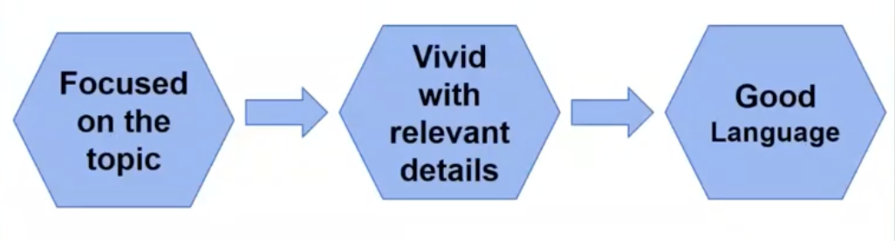
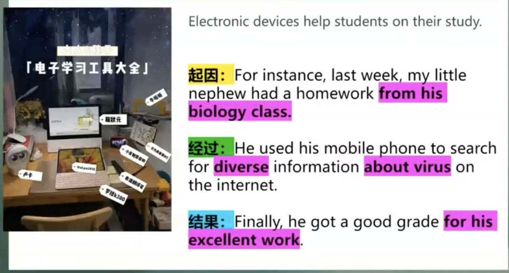

!!! warning
- 细节才是重中之重，一定要在文章中体现出细节
- 结尾一定要紧扣主题
!!!

!!! example
*Which is the better strategy for making purchasing decisions, relying on advice from friends and family, or depending on information from online sources?*

- **cause**: When purchasng an oven
- **process**:I first reciewed product evaluations on `rednote`, then studied operational tutorials on `Bilibili`, compared prices and finally bought one on `Taobao`.
- **result**:The detailed and professional online information `optimized` my decisin-making, `saving both time and money`.
!!!

!!! example
*Whether new, innovative subjects should be taught in public schools*

- **起因**：For illustration, consider a student. Leo, who took artificial intelligence courses in public school.
- **经过**：He **acquired practical skills** that greatly strengthen his competitiveness in future employment in tech corporations. Meanwhile, these courses were **engaging** and **brought him great pleasure** in learning.
- **结果**：which fully proves that innovative subjects benefit students' career development and personal well-being.
!!!

!!! example "Hiring experienced vertans or younger employees"
- **起因**：For illustration, my cousinEthan runs a small digital marketingcompany that focus on online brand promotion. He hired young employees whho have sharp creative thinking.
- **经过**：Their relatively low salaries helped **cut the company's labor by 15%**. Meanwhile, their new ideas **increased customer engagement by 30% and released sales by 20% within six months**.
- **结果**：**This example clearly shows that** young employees can reduce costs and fuel corporate innovation.
!!!

!!! example "Do you think that more cities should make their central zones car-free"

- **起因**：For illustration, Shanghai has not introduced  car-free politics in its city center.
- **经过**：**if such rules were carried out**, shops, restaurants and drivers who rely on  convenient traffic would suffer heavey economic issues. Meanwhile, residents would spend much more time **commuting**, causing great inconvenience.
- **结果**：This clearly shows that car-free zones would harm business and people's well-being.

!!!

!!! example "Do you think digital nomadism is likely to continue increasing"

**For illustration, Leo, a freelance online tutor（一名线上家教）, once worked in an expensive city and spent most of his salary on rent.**

Now he works remotely in low-cost areas and saves a lot of money. He also enjoys flexible hours and can combine work with travel. This makes his life more relaxing and enjoyable.

Clearly， digital nomadism reduces and improve personal well-being.
!!!

#### Universal Illustration

**1. Education and Talent Cultivation**

In Finland, a decade-long shift toward holistic education-propioritizing creativity, emotional intelligence, and practical skills over standardized testing-raised student satisfaction by 30% and reduced high school fropout rates by 40%, **proving that well rounded development enhances both academic engagement and lifelong competence**.

**2. Technology and Social reform**

AI-powered supply chain management in blobal retail reduced operational costs by 25% and boosted revenue by 18% within three years, **showcasing how technology drives economic efficiency and growth.**

**3. Environment**

Norway's tax incentives for electric vehicles——including exemptions from import taxes, VAT, and toll fees--boosted EV adoption from 20% to 80% over a decade, cutting urban CO2 emissions by 35% and spurring local charging infrastructure growth.

### 3.8 Concession and Refutation（让步与反驳）

- **Concession（让步）**：承认对方观点合理
- **Refutation（反驳）**：证明对方观点错误

#### 3.8.1 A or B（对比型）

!!! example 
- `ordinary people`:Admitttedly, **While acknowledging the benefit that** asking celebrities, famous entertainers, or sports figures to promote their products could **bring a sense of happiness of adoring celebrities.** **Neverthless**, **the superiority of** to have ordinary people talk about the product **lies in** improving advertising profit and efficiency(全文两个论点做总结), **makig it the preferable choice**.
- `celebrities`:Admittedly, **while acknowledging the benefit that** to have ordinary people talk about the product could bring a more down-to-earth vibe(接地气的效果). **Nevertheless**, **the superiority of** asking celebrities, famous entertainers, or sports figures to promote their products **lies in** improving advertising profit and efficiency, **making it the preferable choice**.
!!!

!!! example 
*Which do you think contributes more to a person's health and happiness:spending time with a close-knit few or a larger group of friends?*

While acknowledging the benefit that a large group of friends can bring more excitement and social opportunities, nevertheless, the superority of spending time with a close-knit few lies in deeper trust and emotional support, making it a preferable choice.
!!!

#### 3.8.2 Yes or No（判断型）

- `Which acknowledging the concern that X harms/affects...`
- `Which acknowledging the benefit that X improves/promotes...`

!!! example
**Yes**

**Admittedly**（诚然）, **while acknowledging the concern that** rapid advancement of science **harms/affects** morality and environment. **Nevertheless**, **its benefits in** improving/promoting economy and efficiency **far outweigh these concerns, thus making it imperative**.

**No**

Admittedly, while acknowledging the benefit that rapid advancement of science improves/promotes economy and efficiency. Neverthless, its concerns in harming/affecting morality and environment far outweigh these benefits, thus making it imperative.
!!!

!!! example
*Do you think that more cities should make their central zones car-free?*

Admittedy, while acknowledgeing the benefit that central zones car-free can reduce pollution and traffic noise, nevertheless, its concerns in inconvenience and negative impacts on local businesses far outweigh these benefits, thus makinng it unwarranted.
!!!

!!! example
*Do you think high schools should implement mandatory evening classes*

Admittedly, while acknowledging the concern that mandatory evening classes puts more pressure on students and leaves less free time for them. Nevertheless, its benefits concentrating more energy and attention on study and push them to keep forward far outweigh these benefits, thus making it imperative.
!!!

#### 3.8.3 How（方案型）

> 给出你的solution,与`A or B`类型的区别在于需要自己给出A，B这两种解决方案

- **imaginary enemy**

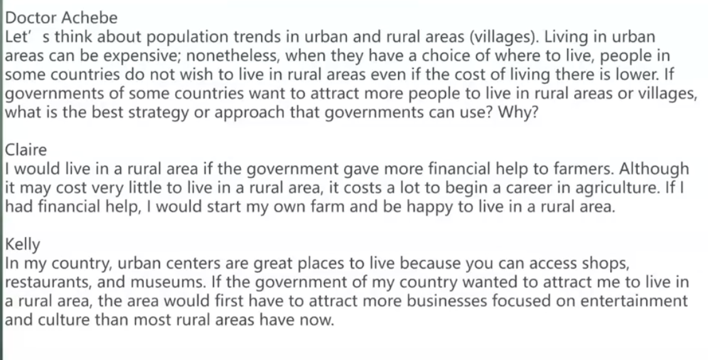

*Admittedly, **while ackowledging the benefit that** financial subsides could do some extent encourage people to live in rural areas. **Neverthless, the superiority of** construction of suburban infrastructure **lies in** improvin/promoting a sense of happiness and security, **making it the preferable choice**.*

## 4 Word Choice and Hedging（词汇选择与模糊陈述）

### 4.1 Word Choice（词汇选择）

- 不具描述性的词语：`thing`,`happy`, `good`,`big`,`nice`, `bad`
- 更具体的词语：`phenomenon` or `concept`,`effective`, `beneficial`, `significant`, `substantial`, `commendable`（值得称赞的）, `specific`, `sad`, `heart-breaking`
- 模糊→清晰

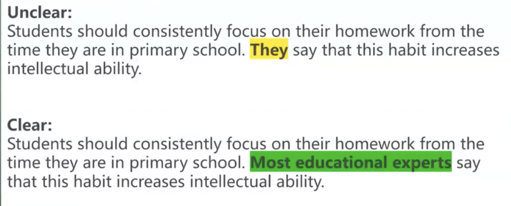

### 4.2 Hedging（模糊陈述）

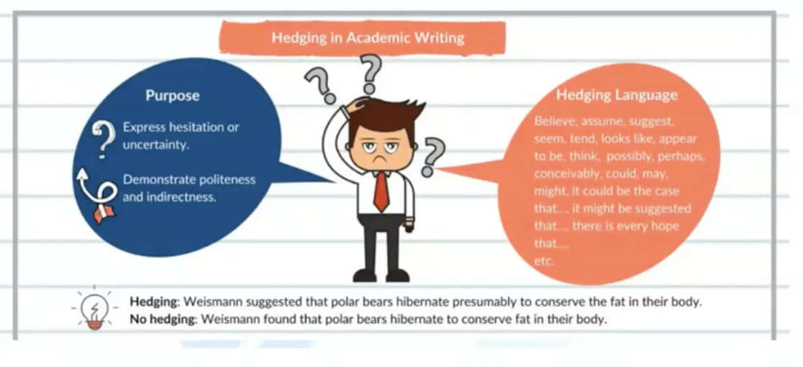

- 绝对化的语言体系
  - clickbait
  - slogan
  - small talks
  - advertising

**Methods**

- 忽略了可能性 
  - 使用情态动词(modal verbs)和情态短语(modal phrases),如可能(might)，可以(could)等
  - 使用修饰词(modifiers) ,如可能的(possible),可能地(potentially)等，来修饰陈述并减少绝对性
- 忽略了条件
  - 使用条件句(conditional sentences)，如如果(if), 除非(unless)等，来表示某种条件下的可能性或不确定性

## 5 Logical Errors（逻辑错误）

### 5.1 Irrlevant Information Insertion

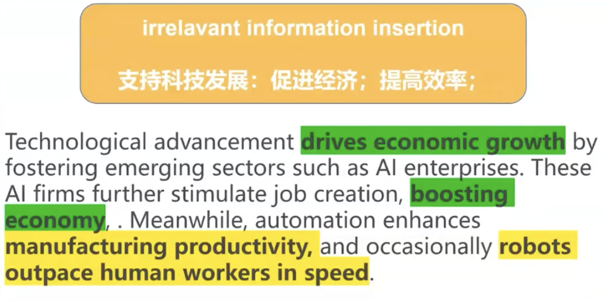

> 论述具体论点的时候要根据论点进行论述，不能插入无关信息，比如论述省钱但是不能插入生活幸福

### 5.2 Logical Jump（逻辑跳跃）

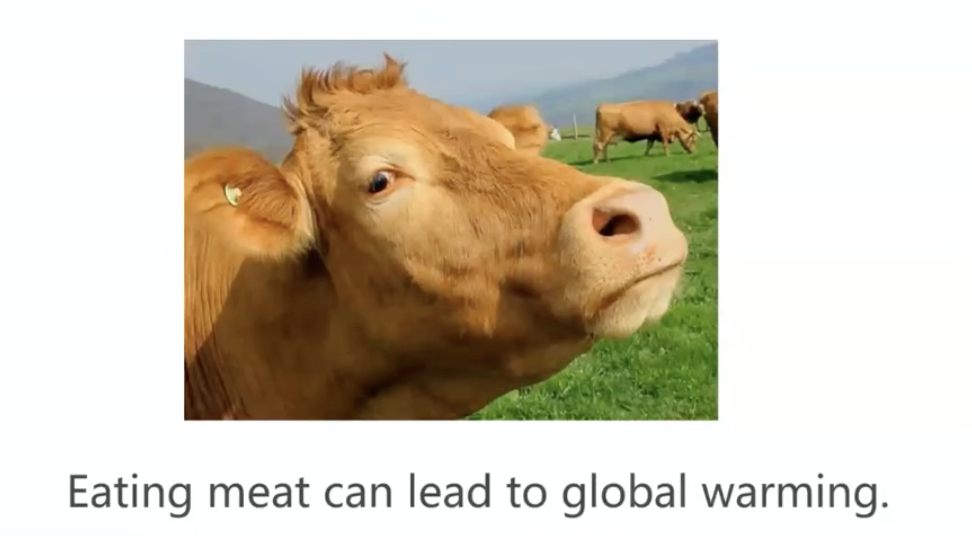

> 结论本身可能是正确的，但是要有完整的逻辑链条，不能只说结论不说原因

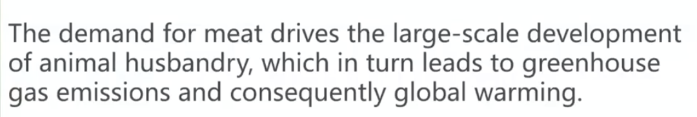

### 5.3 Discussion Redundancy（讨论冗余）

> 一些常识性的内容不需要展开论述

> 将文章写成肥皂剧的典型案例

!!! tip
一定要保证讲故事的过程遵循

- 起因
- 经过
- 结果

即可
!!!

### 5.4 Self-contradiction（自相矛盾）

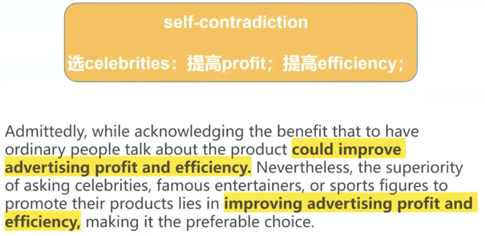

!!! tip
- 要始终围绕论点，不能左右逢源
- 可以从不同的角度思考问题，但是不能同时赞同不同的角度
!!!

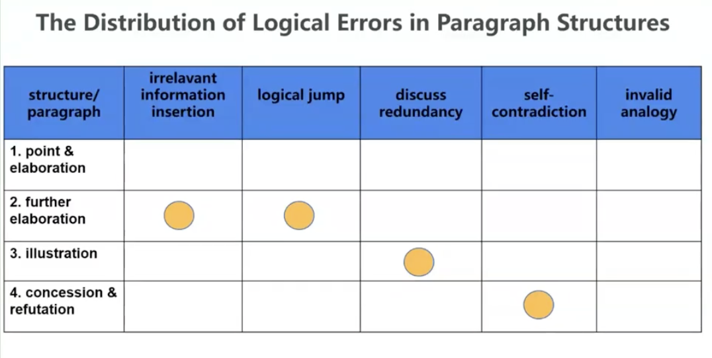

## 6 词汇积累

- African American:黑人
- `assignment in subject`:学科作业
- `nomad`:流浪者，游民
- `rising emergent tendency`: 日益增强的新兴趋势
- `burnout`:倦怠
- `veterans`: 老兵、经验丰富的人
- `financial subsidies`:津贴
- `elaboration`:阐述
- `prospective`:未来的、预期的，比future更正式
- `hinder`:妨碍
- `impete`:阻止
- `economical` = `cost-effective`
- `fiscal revenue`:财政收入
- `streamline`:使效率更高；精简；使合理化
- `running tally`:流水账
- `unwarranted`:未经授权的,没有正当理由的
- `morality`:道德
- `hedge`:树篱、规避风险

## 7 练习

*Do you think digital nomadism is likely to continue increasing?*

- Support 
  - Money:save a lot on rent, cost-effective, financially, rising emergent tendency
  - Time:no longer wasting time on commuting, flexible
  - WELL-BEING:more fulfiled mental, burnout

- OPPOSE
  - MONEY:financial stress, not everyone can afford this lifestyle long term
  - TIME:less free time than expected
  - WELL-BEING:mental well-being, lonely, anxiety

*Is offering personalization essential for modern business*

- Support
  - Money:to customers' demand
  - Time:save customers' time
  - Well-Being:feel special and valued
- Oppose
  - Money:expensive
  - Time:time-consuming(采集客户信息)
  - Well-Being:privacy

*Should companies focus their business development on the local market or prioritize expanding into the international market*

- Local market
  - Money:cost-effective, higher profits
  - Time:time-saving,
  - Well-being:boost local employment, more satisfying, community
- International market
  - Money:expand market, higher profits,
  - Well-Being:creative, innovative

*Should anthropologists participate cultural rituals, while others argue that they should observe these rituals from a distance rather than participate in them.*

- Participate
  - Time: Higher effeciency
  - Well-Being:academic output, in-depth, more-profound
- From a distance
  - Money:cost-effective, save money
  - Well-Being:more secure

`future employment`, `high efficiency`,`revenue`(tax topic,只要是机构收钱就和revenue有关系),`environmental protection`, `financial burden`, `conveninent`,`financial subsides`(财政补贴,经济补助),`transportation`,`infrastrature`，`boost local employment`,